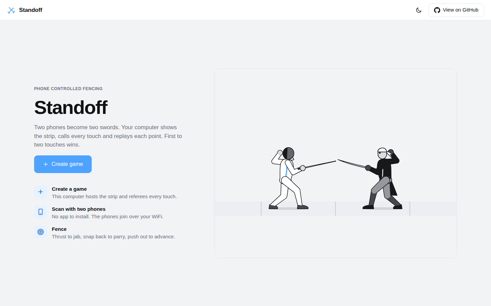
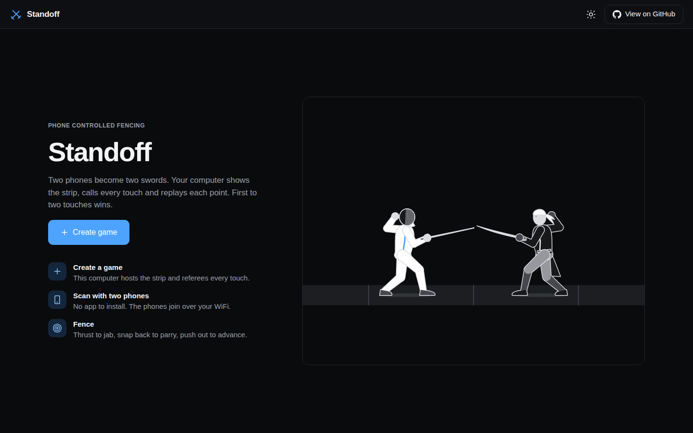
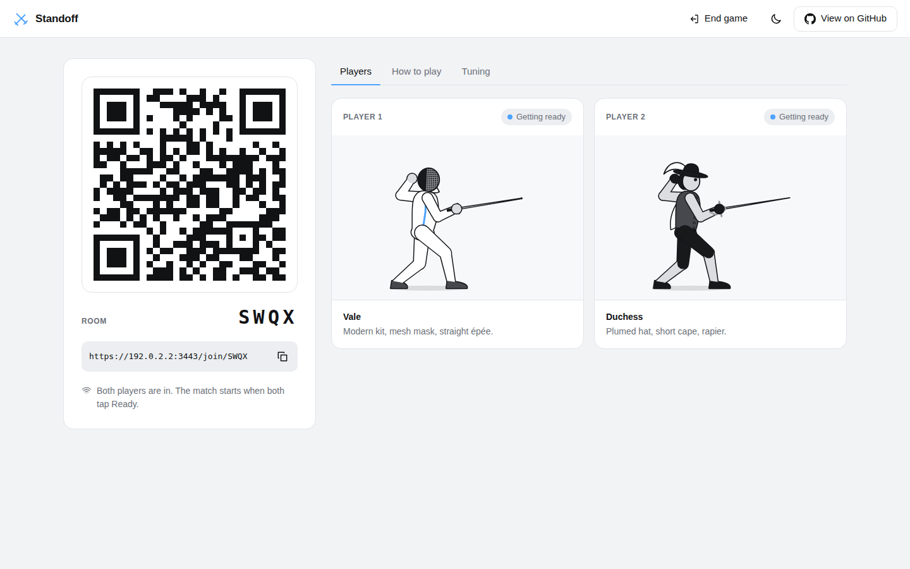
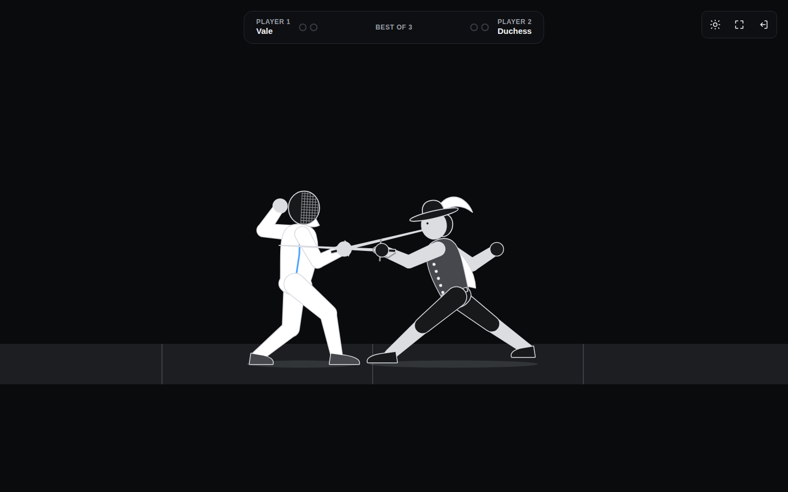
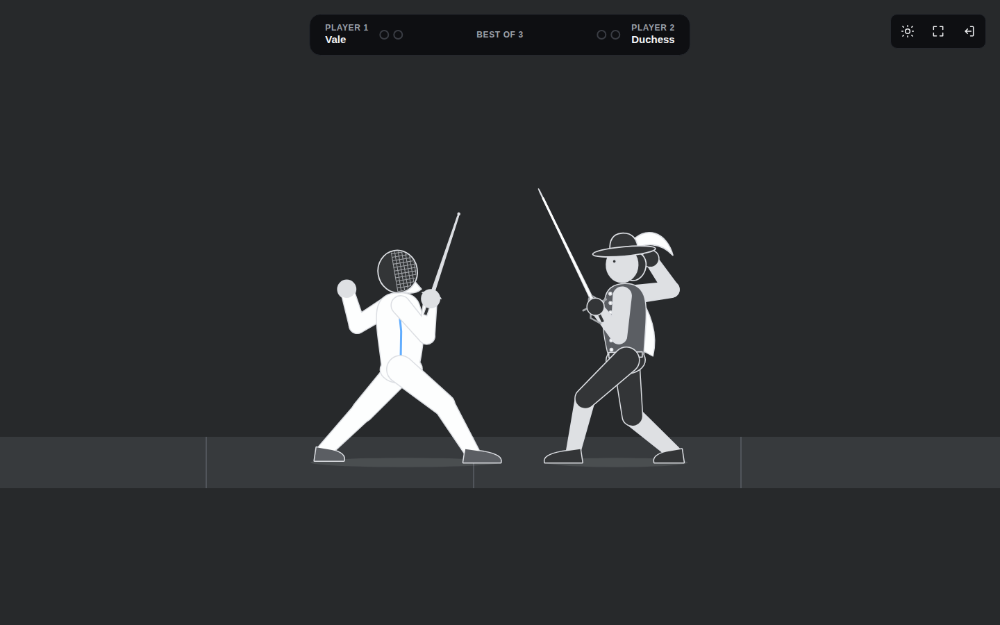
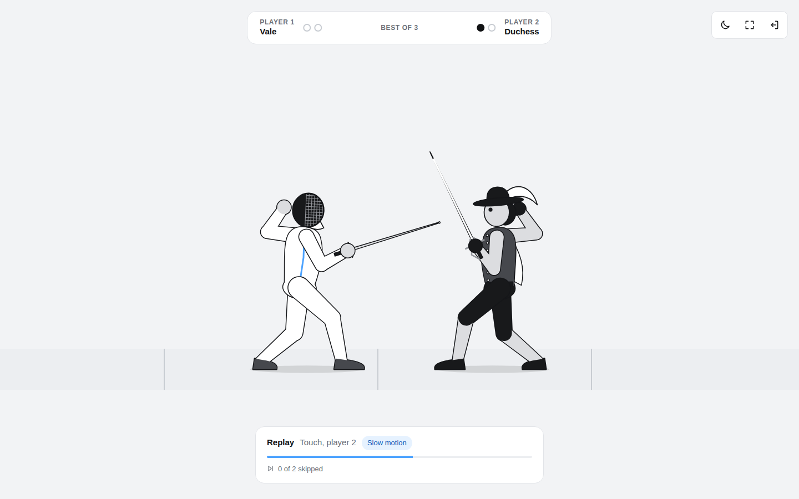

# Standoff

Standoff is a 1v1 fencing game for two people and one computer. Each player's phone becomes their sword. Point the phone and the blade on screen points with it. Thrust it to jab, snap it back to parry, and push your arm out to advance down the strip. The computer shows the strip, referees every touch and replays each point. First to two touches wins.

There is nothing to install on the phones and no account to make. The computer runs a small server on your WiFi and shows a QR code, and the phones join by scanning it. Nothing is saved anywhere. Close it and the game is gone.

## Screenshots

The start screen, in light and dark mode.





The lobby. Phones scan the code, pick a fencer and calibrate.



A lunge landing, and a parry turning one away.





Every touch gets a replay, slowed down around the moment it lands.



On the phone: picking a fencer, calibrating, and the pad during a bout.

<p>
  
  
  
</p>

## How to play

1. Open Standoff on the computer and press **Create game**.
2. Both players scan the QR code with their phone and tap **Tap to enable motion and sound**.
3. Pick a fencer. Grip the phone like a sword handle, screen up, top edge pointing at the computer, and tap **Calibrate**. Then tap **Ready**.
4. After the countdown, fence:
   * **Aim** by pointing the phone. A jab only lands if your tip points at your opponent.
   * **Jab** with a short, fast thrust forward. Your fencer lunges.
   * **Parry** with a short, fast snap back toward you. For one second any jab that reaches you is blocked, and the attacker is knocked off balance.
   * **Advance** by pushing your arm out and holding it there. Pull it in and hold to retreat. Rest it in the middle to stand still.
5. After each touch both players watch the replay, or both tap **Skip**. First to two touches wins, and a rematch needs no new scan.

A phone without motion sensors (a laptop joining to test, for example) can play with on screen Jab and Parry buttons and a footwork slider.

## Running it

You need Node 20.9 or newer, and the computer and both phones on the same WiFi.

```bash
npm install
npm run dev
```

The terminal prints two addresses:

```
Open on this computer:  http://localhost:3000
Phones join through:    https://192.168.1.20:3443
```

Open the first one on the computer. The QR code in the lobby already points at the second one.

**The certificate warning.** Phones only share motion sensor data with pages served over HTTPS, so the phone side runs on HTTPS with a certificate the server makes for itself on first start. Each phone shows a warning the first time. On iPhone tap *Show Details*, then *visit this website*. On Android Chrome tap *Advanced*, then *Proceed*. The certificate is kept in `certs/`, so this only happens once per network address. If you would rather skip the warning, make a trusted certificate with [mkcert](https://github.com/FiloSottile/mkcert), install its root on the phones, and save the pair as `certs/key.pem` and `certs/cert.pem`. The server uses yours when it finds them.

For a production build:

```bash
npm run build
npm start
```

| Command | What it does |
| --- | --- |
| `npm run dev` | Development server with hot reload |
| `npm run build` | Production build of the pages |
| `npm start` | Production server |
| `npm test` | Unit tests |
| `npm run typecheck` | TypeScript check |
| `npm run lint` | ESLint |

| Variable | Default | Purpose |
| --- | --- | --- |
| `PORT` | `3000` | HTTP port for the computer |
| `HTTPS_PORT` | `3443` | HTTPS port for the phones |
| `HOST` | `0.0.0.0` | Interface to listen on |
| `PUBLIC_HOST` | LAN address | Address put in the QR code, if the detected one is wrong |

**If the phones cannot connect**, check they are on the same WiFi as the computer (not a guest network), and that the macOS firewall allows incoming connections for Node. If the QR code shows the wrong address, for example a VPN one, start with `PUBLIC_HOST=192.168.1.20 npm run dev` using the address from *System Settings, Wi-Fi, Details*.

## How it works

### The pieces

One Node process runs everything. `server/index.ts` starts Next for the pages and a WebSocket endpoint at `/ws`, on two listeners: plain HTTP for the computer (browsers treat `localhost` as secure already) and HTTPS for the phones.

The server keeps rooms in memory and routes messages. It makes no game decisions. The computer's browser tab is the referee: it runs the match engine, draws the strip and plays the sound. Phones read their own sensors, turn them into sword angles, footwork and strikes, and stream the result to the host through the server. Everything a phone shows comes back from the host as a small state message, so a phone that reconnects mid match is up to date on the first message it gets.

Rooms have a four letter code. Each phone gets a seat token kept in session storage, so reloading the page puts you back in your seat, and the host can reload too without losing the room. Every incoming frame is validated with zod, rate limited, and dropped if it could not have come from a real controller.

### Sword tracking

The phone's orientation (`deviceorientation`) becomes a quaternion, and the phone's top edge rotated by it is the blade direction. Calibration stores that direction as the guard. From then on the blade's elevation and swing relative to the guard drive the sword on screen every frame. It reads an angle directly, so there is nothing to drift. Swinging the blade toward or away from the camera foreshortens it and dips the tip a little, which is how circling the phone shows up as the blade circling in a side view.

### Jabs and parries

Acceleration (`devicemotion`, with gravity removed) is rotated into the earth frame and projected onto the strip line, the level direction the phone pointed at when calibrating. So a thrust counts the same with the tip high or low.

A jab is that signal climbing from quiet past the jab threshold within 160 ms. A parry is the same thing backwards. The rise window is what keeps a slow push of the arm reading as footwork instead of a strike. Both are edge triggered, and after either one the detector ignores everything for a short refractory period, because every jab ends with the arm braking and every parry ends with it springing back, and those recoveries look exactly like the opposite strike.

### Footwork

Forward acceleration is integrated twice into how far the arm is from where it started. That offset maps straight to walking speed, with a small deadzone around centre, so holding your arm out keeps you advancing at a steady pace for as long as you hold it.

Double integration drifts, so two things keep it honest. When the phone has been still for about 200 ms, velocity snaps to zero, which stops sensor noise from building up while the arm is held. And every en garde zeroes the offset, so whatever drift remains lasts one exchange at most. Strikes are cut out of the integration too: when a jab fires, tracking rewinds to where the arm was before the thrust began and resumes once it settles.

Movement sits behind one interface in `src/motion/movement/`. If position tracking feels unreliable, switch the Tuning tab to **Tilt**, where twisting the wrist sets the speed instead. It reads an angle directly, so it cannot drift. Nothing else changes.

### The referee

The host steps the match at a fixed 60 Hz. A jab does not land when it is detected: the tip takes 140 ms to arrive, and the defender's parry window is checked at the moment of arrival. That gap is what lets a fast reaction save a touch. A jab also has to be in range and on target (the live blade pointing within 55 degrees of the line). Two touches within 60 ms of each other cancel out, like a double in épée. If both fencers walk into each other, it is called corps-à-corps and they are put back at a safe distance.

### Fencers and characters

Every fencer is a cutout rig: separate art pieces for the head, torso, arms, legs and sword, hung on one skeleton and drawn with canvas paths. A pose is a handful of numbers (hip position, lean, where each foot and hand is, blade angle). Knees and elbows are solved with two bone IK, so poses stay small enough to blend field by field.

The sword arm follows the phone. Jabs, parries, deflections, hits, and the victory and defeat poses are layered on top by a small animator. Each action has a weight that snaps toward 1 when it starts and eases back to 0 after, which is how a lunge briefly takes over the tracked sword and then springs back to following your hand. The feet step in time with distance travelled, so a retreat plays the same step backwards, back foot first, which is how fencers actually retreat.

The four characters (Vale, Duchess, Marrow, Iron) share that skeleton and animation. A character is only a choice of art pieces and tones, so all of them stay fully reactive. Player one's details are drawn in the accent colour and player two's in white, so the two read apart on the strip.

### Replays

While play is live the engine records every frame (positions, blade angles, the current action and how far into it) and every event. A frame is a few numbers, so seconds of history cost almost nothing, and there is no video. After a touch the replay feeds the last three seconds back through the same renderer, slowing to 30 percent around the moment of the touch and interpolating frames so the slow part stays smooth. Sounds replay with it. It ends when it finishes, when both players skip, or after the timeout, whichever comes first, so a phone that drops out cannot stall the match.

### Sound

All of it is synthesized with the Web Audio API, so there are no audio files. Four buses (music, crowd, effects, interface) feed a limiter. Each combat sound fires off the same game event that starts the animation, so they land on the same frame. The music is two step sequenced loops, an ambient one for the lobby and a driving one for the match, scheduled ahead on the audio clock so timing holds while the page is busy drawing. It ducks under cheers and drops right back during replays.

The crowd murmurs under the whole match. Cheers are rationed on purpose: only a clash (both fence at once and one parries) or a match point earns one, with a cooldown between them, so they stay exciting.

iOS will not start audio or share motion until the user taps, so the phone's first screen does both in a single tap, along with a screen wake lock so the phone does not dim mid bout. Haptics use `navigator.vibrate`, which works on Android. iOS Safari has never supported it and the old checkbox trick was closed in iOS 26.5, so on iPhones the computer's sound carries the feedback.

### Tuning

Every value that is worth adjusting by feel is live in the lobby's **Tuning** tab, and changes reach both phones immediately. Nothing is saved, so a new game starts from the defaults.

| Setting | Default | What it changes |
| --- | --- | --- |
| Jab threshold | 14 m/s² | How hard a thrust has to be |
| Parry threshold | 12 m/s² | How hard a pull back has to be |
| Parry window | 1000 ms | How long a parry blocks |
| Refractory period | 350 ms | Quiet time after any strike |
| Movement model | Position | Position tracking or tilt |
| Stillness threshold | 0.35 m/s² | How still counts as still |
| Stillness time | 200 ms | How long before velocity resets |
| Offset for full speed | 0.18 m | How far out the arm goes for top speed |
| Offset deadzone | 0.03 m | Offset that still counts as standing |
| Tilt deadzone and full speed | 8° and 35° | The same, for tilt mode |
| Replay timeout | 10 s | When a replay ends on its own |
| Music, crowd, effects | 0.5, 0.6, 0.9 | Mix levels |
| Cheer cooldown | 8 s | Minimum gap between cheers |

These are starting points. Expect to move them once two people are actually playing.

## Project layout

```
server/                 Node entry: Next, HTTPS, the /ws endpoint
  rooms/                In-memory rooms, seats and message routing
  realtime/             WebSocket wiring, validation, rate limiting
src/
  app/                  Next routes: the host page and /join/[code]
  shared/               Protocol schemas, tuning, characters, shared types
  motion/               Phone side sensor processing, no browser APIs
    movement/           Position tracking and the tilt fallback
  game/                 Host side engine: fencers, referee, match, replay
  rig/                  Skeleton, IK, poses, animator, art pieces, skins
  render/               Canvas renderer, camera, strip, hit flash
  audio/                Web Audio engine, effects, crowd, music, director
  net/                  Reconnecting WebSocket client
  host/                 Host session, lobby and screens
  controller/           Phone session, sensors and screens
  components/           Shared interface pieces
  styles/               Stylesheets per area
```

The motion, game and rig folders have no DOM or network code in them, which is what lets the tests drive them with synthetic sensor readings and scripted matches.

## Tests

```bash
npm test
```

60 tests cover the room registry and rate limiter, the motion pipeline fed with synthetic sensor data, jab, parry and footwork detection, the referee, match flow, replay timing, the engine playing whole exchanges, the rig's IK and animator, the lobby rules, tuning clamps and protocol validation.

## Playing over the internet

Standoff is built for one room on a local network, where the round trip is a few milliseconds against a one second parry window. Moving it to a host like Vercel is possible but not done here. Vercel Functions accept WebSocket connections, but two phones may land on different function instances, so the rooms in `server/rooms/` would need a pub/sub layer such as Redis between instances. The rooms only talk to connections through a small `Peer` interface, so that swap would stay inside the server folder. The bigger question is feel: internet latency eats into the parry window, so it is worth playing locally first.
