# Standoff

Standoff is a games console in the browser. One computer is the screen, and every player's phone is their controller. There is nothing to install and no account to make: open the site on a computer, pick a game, and everyone scans the QR code with their phone. Each player types a name, and the game starts.

Fencing is the first game. Your phone is the sword: tilt it and the blade on screen follows, chop down to jab, lift up to parry, and hold Forward or Back to move. Fruit Ninja, Magic Kart, Zombie Survival and Shooting Gallery are on the home screen and in development, each with a brief in its folder under `src/games`.

It runs on Vercel for play from anywhere, or on your own computer over WiFi. Nothing is saved on the server: close it and the game is gone.

Play it at [standoff-five.vercel.app](https://standoff-five.vercel.app).

## Screenshots

The home screen works like a console menu. A row of square tiles shows each game's art, and the chosen one grows and gets a ring in its own colour. Its art fills the screen behind, with its name, what it is, how many can play and a Host Game button below the row. Opening the app picks a game at random. Click a tile or use the left and right arrow keys to choose, and press Enter, click the chosen tile again or press Host Game to start. Games still being built say Coming soon.

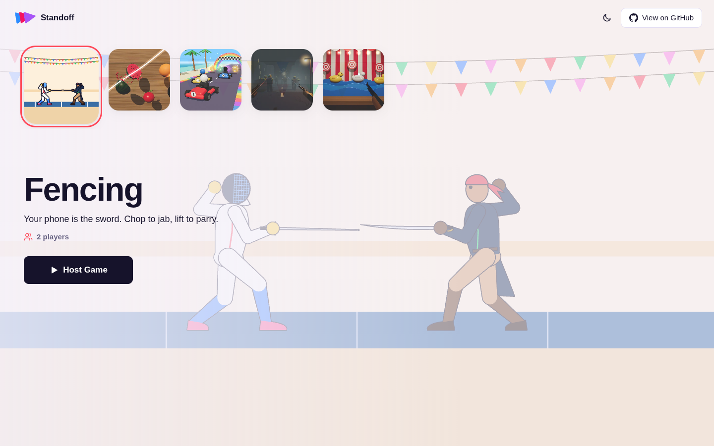

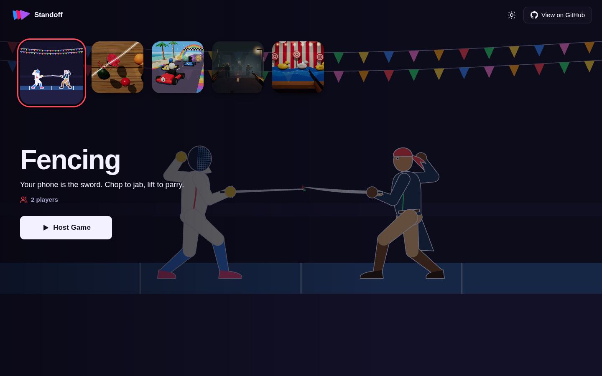

Hosting a game opens a room. The QR code waits in the middle, then moves to the bottom left once someone joins, until the game starts. The logo at the top left always leads home.

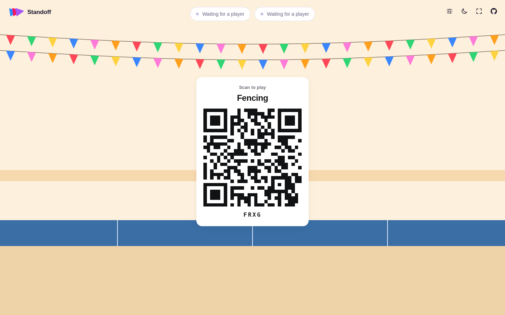

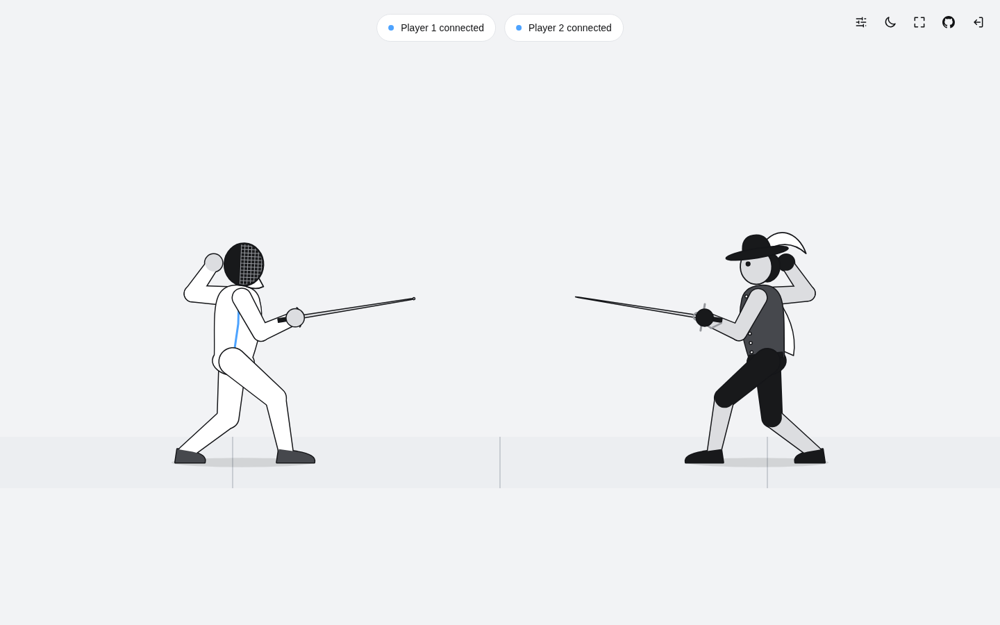

Playing alone, the computer takes the other line, and a friend who scans the code later takes its place.

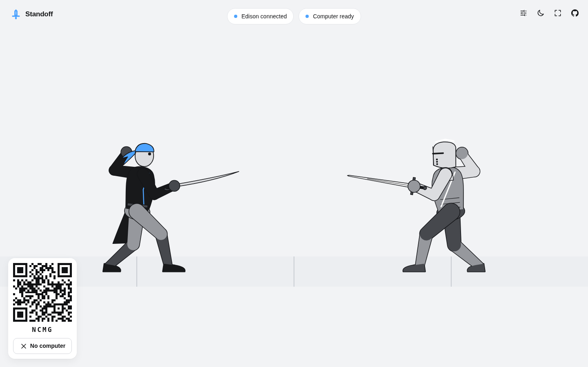

The blade follows the phone and leaves a fading trail. A parry throws sparks where the blades meet.

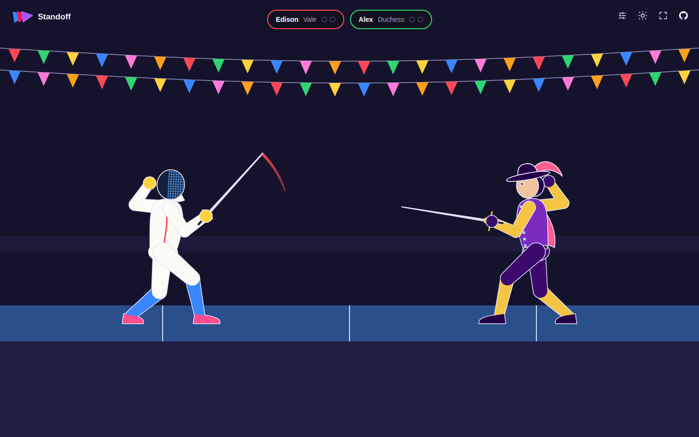

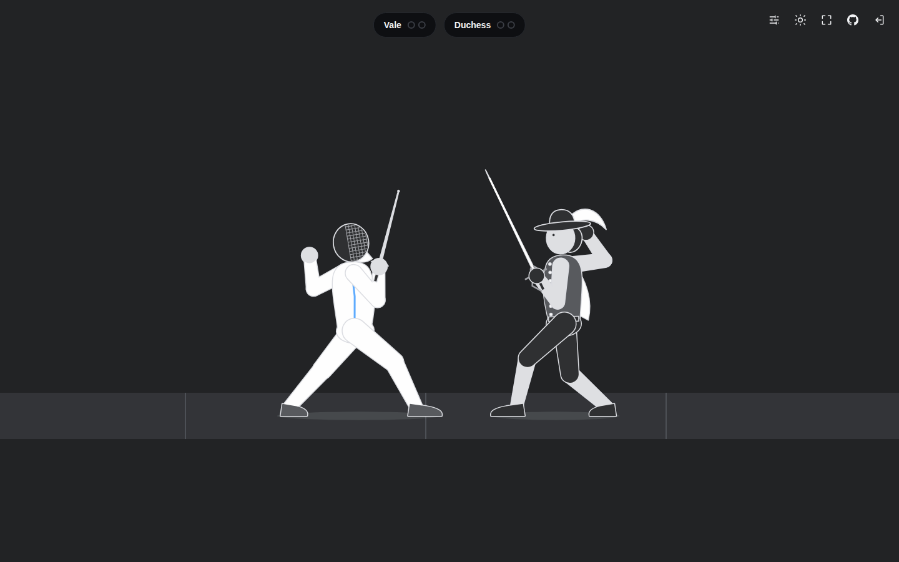

A touch slows the game right down, then a burst goes off where the blade landed.

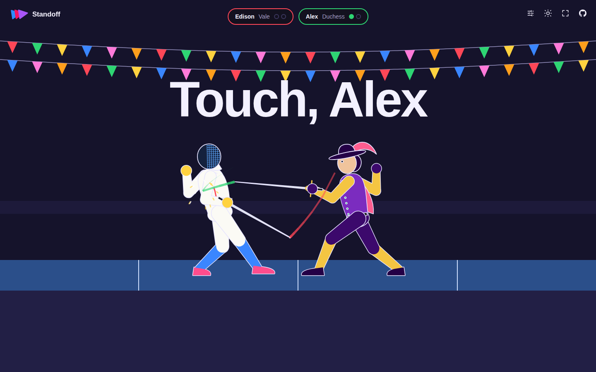

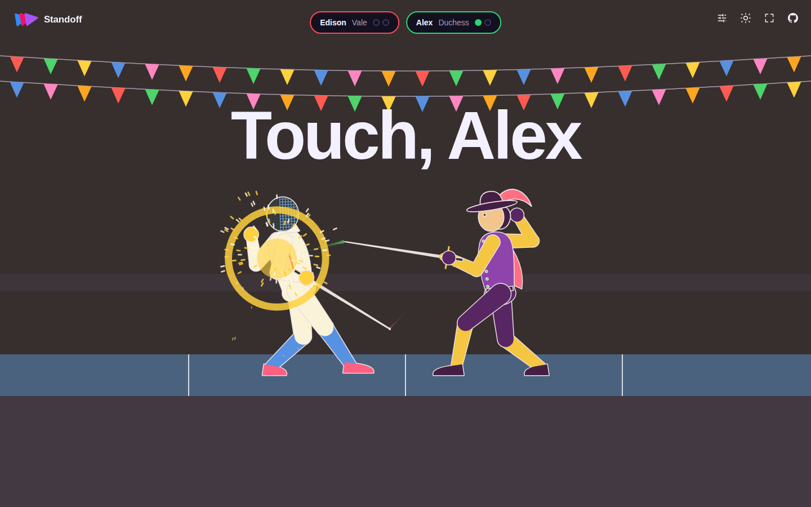

The winner gets confetti.

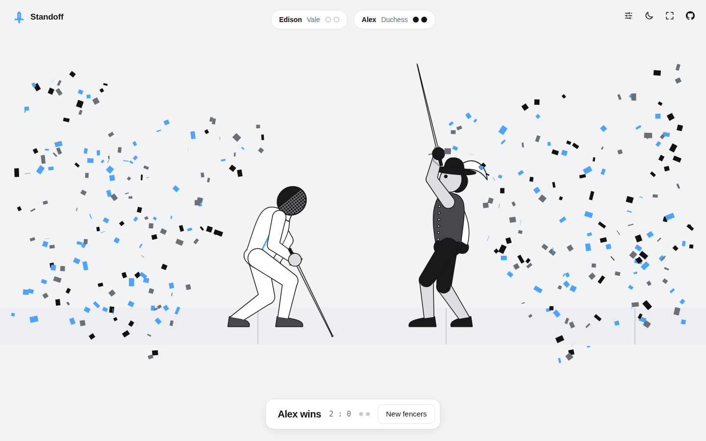

On the phone: a name (or Skip), then one page per step. Calibrate first: the drawing shows where to point, and the level shows when the phone is flat, so the guard is easy to find again. Then pick a fencer, then Ready. In a bout, two big buttons move you.

<p>
  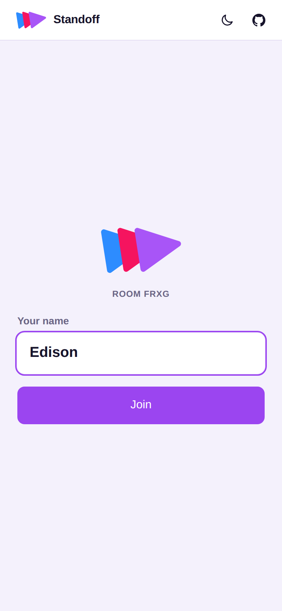
  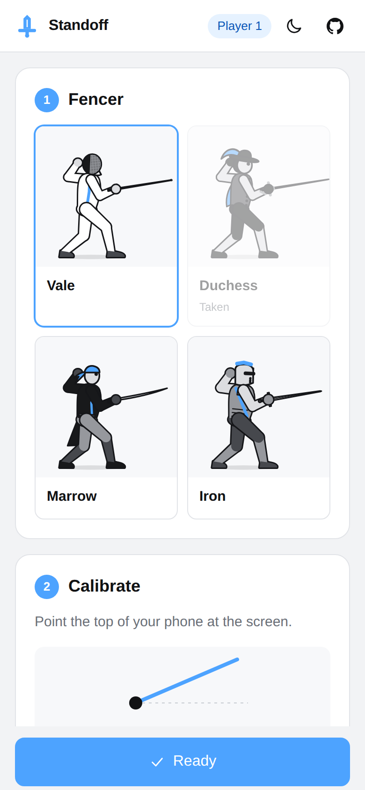
  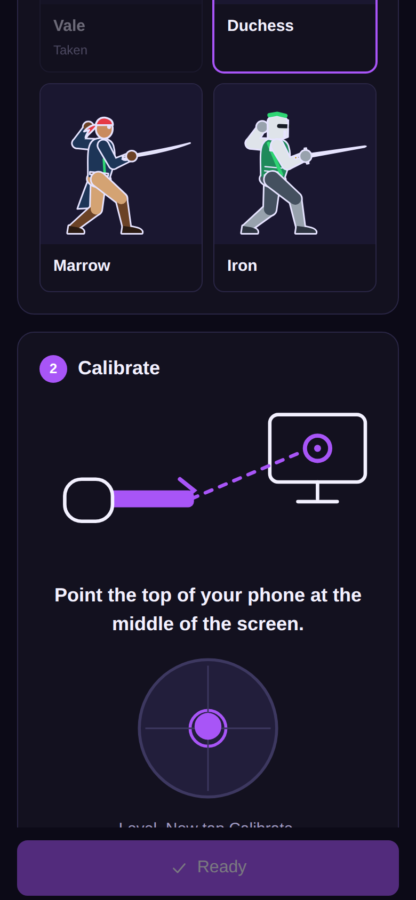
</p>

<p>
  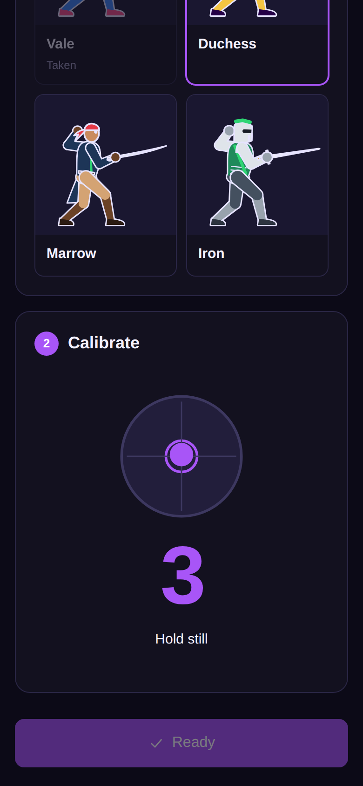
  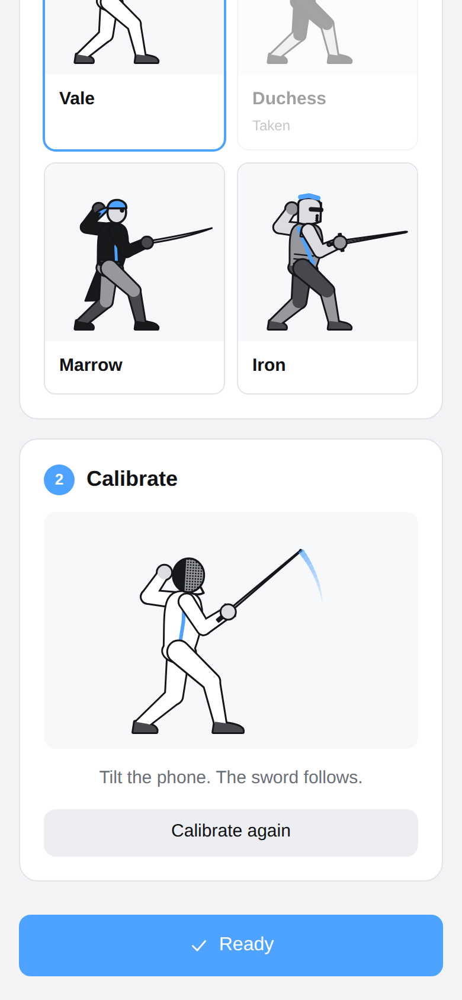
  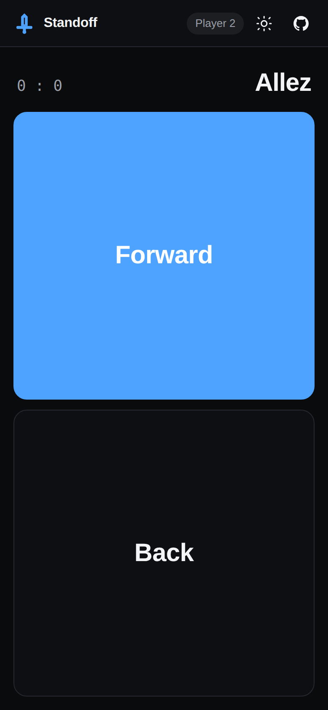
</p>

## How to play

1. On the computer, click a game. Scan the QR code with each phone, type a name and tap **Join**, or tap **Skip**.
2. For fencing, calibrate first. Hold the phone flat like a sword, top edge pointing at the middle of the screen. When the dot sits in the circle, tap **Calibrate** and hold still through the countdown. Then pick a fencer, and tap **Ready**.
3. Fence:
   * **Aim** by tilting the phone. A jab only lands if your tip points at your opponent.
   * **Jab** with a short, sharp chop down.
   * **Parry** with a short, sharp lift up. For one second any jab that reaches you is blocked, and the attacker is knocked off balance.
   * **Move** by holding **Forward** or **Back**.
4. First to two touches wins. A rematch needs no new scan.

To fence alone, tap **Play the computer** on the phone, or **Play solo** on the join card. A device without motion sensors gets on screen Jab and Parry buttons.

## Running it

There are two ways to run Standoff, and they share all their code.

### On Vercel

1. Import this repository into Vercel. It builds as a normal Next.js app.
2. In the project, open **Storage**, add **Upstash for Redis** from the Marketplace and connect it to the project. That sets `REDIS_URL`.
3. Redeploy, so the new variable reaches the functions.

Redis is what lets the host and the phones find each other. On Vercel each connection is held by one function instance, and the three connections may land on three different instances. Without Redis some joins fail to find the room. Phones retry a few times, so it often still works, but not reliably. WebSockets need Fluid compute, which is on by default for projects created since April 2025.

Chrome and Firefox can only reach the game through the HTTP fallback on Vercel today (see *The HTTP fallback* below). That fallback leans on Redis even more, so treat Redis as required.

On the Hobby plan Vercel ends every socket after five minutes. The server warns each client 30 seconds early, and the client moves to a fresh socket without dropping the game (see *Socket handover* below), so a match never notices.

### On your own computer

You need Node 20.9 or newer, with the computer and the phones on the same WiFi.

```bash
npm install
npm run dev
```

The terminal prints two addresses:

```
Open on this computer:  http://localhost:3000
Phones join through:    https://192.168.1.20:3443
```

Open the first one on the computer. The QR code already points at the second one.

Phones only share motion sensor data with pages served over HTTPS, so the phone side runs on HTTPS with a certificate the server makes for itself on first start. Each phone shows a warning the first time. On iPhone tap *Show Details*, then *visit this website*. On Android Chrome tap *Advanced*, then *Proceed*. The certificate is kept in `certs/`, so this happens once per network address. To skip the warning, make a trusted certificate with [mkcert](https://github.com/FiloSottile/mkcert), install its root on the phones, and save the pair as `certs/key.pem` and `certs/cert.pem`.

Public and guest WiFi usually stop devices from reaching each other, so on those networks use the Vercel version instead. If the QR code shows the wrong address (a VPN, for example), start with `PUBLIC_HOST=192.168.1.20 npm run dev`.

| Command | What it does |
| --- | --- |
| `npm run dev` | Local server with hot reload |
| `npm run build` | Production build |
| `npm start` | Local production server |
| `npm test` | Unit tests |
| `npm run typecheck` | TypeScript check |
| `npm run lint` | ESLint |

| Variable | Default | Purpose |
| --- | --- | --- |
| `REDIS_URL` | none | Shared room store. Set by the Vercel Redis integration. `KV_URL` also works |
| `PORT` | `3000` | Local HTTP port for the computer |
| `HTTPS_PORT` | `3443` | Local HTTPS port for the phones |
| `HOST` | `0.0.0.0` | Local interface to listen on |
| `PUBLIC_HOST` | LAN address | Address put in the QR code locally |
| `SOCKET_LIFETIME_MS` | off | Cuts local sockets after this long, like Vercel, to try the handover |

## How it works

### The platform and the games

`src/platform` is the console: the home screen, rooms, joining, names, reconnects, and the frame around every game. Each game is a folder in `src/games` that plugs in through one contract, `src/platform/games/game-api.ts`. A game supplies a host screen for the computer and a phone screen, and exchanges messages of its own design with its phones. It never imports another game, so several games can be built at once without touching the same files. `src/games/README.md` explains how to add one.

The platform keeps two message kinds for itself. A phone sends `profile` with its player's name, and the host sends every phone `players`, the line up. Games never see either.

Inside a game, the computer is the referee. Phones send raw input, and everything they show comes back from the host.

### The relay

Between the computer and the phones sits a relay that makes no game decisions. It seats players, remembers who holds which seat, and passes messages along. It checks only that a message has a `kind` and fits the size cap, so a new game needs nothing from it. Locally, one Node process (`server/index.ts`) serves the pages and accepts sockets at `/api/ws`, and rooms live in memory. On Vercel, a Next.js route at `src/app/api/ws/route.ts` takes over each socket from the runtime, and rooms live in Redis. A second route, `/api/stream`, carries the same relay over plain HTTP for browsers whose WebSocket cannot open.

The seat rules are plain functions over a small room record (`src/platform/relay/room-state.ts`): the lowest free seat goes to the next phone, up to the one to four seats the game asked for, a known seat token gets its old seat back, and a seat or a room is kept for a grace period after its player drops. Two things sit under those rules:

* A **store** that updates one room atomically. In memory that is free. In Redis each update takes a short lock on the room, reads the record, applies the same rules and writes it back, so two instances racing to seat two phones can never both put them in seat one.
* A **bus** for messages. In memory it is a local pub/sub. In Redis it is Redis pub/sub, with one subscriber connection per instance that fans messages out to the sockets it holds.

Each socket is one `RelayConnection` (`src/platform/relay/relay-connection.ts`). It handles its messages one at a time in arrival order and never talks to another socket directly, only to the store and the bus. When a phone reloads and reclaims its seat on a different instance, the relay sends a kick over the bus and the old socket closes itself. If the host drops and never comes back, the phones' own connections close the room after the grace period, because on Vercel there is no central process to run that timer.

Every frame is validated with zod and rate limited per socket. Room creation and wrong room codes are capped per address, with the counters in the store so every instance shares them, and a room whose host has left gives its code back a minute later. A create, resume or join that fails part way, on a Redis error say, is undone and answered with an error the client retries. Seat and host tokens live in session storage and in the page, never in a URL or a log.

### Socket handover

Vercel ends every function at its maximum duration, sockets included. The route reads the real cutoff with `getDeadline()`, and the relay sends the client `server:rotate` 30 seconds before it (a third of the life, for shorter ones). The client (`src/platform/net/socket-client.ts`) then opens a second socket and rejoins on it. Outgoing messages switch to the new socket as soon as it opens, because the relay queues them behind the rejoin. Incoming messages switch once the new socket confirms the seat. Until then the old one keeps delivering, so nothing is lost or doubled. The relay kicks the old socket once the new one holds the seat, and the host never sees the player leave. If the new socket dies before confirming, whatever went out on it is sent again on the old one. Start the local server with `SOCKET_LIFETIME_MS=36000` to watch it happen every few seconds.

### The HTTP fallback

Chrome and Firefox open a WebSocket over the page's existing HTTP/2 connection whenever the server allows it, and Vercel's edge does. Those WebSockets currently fail at the edge with a 502, before our code ever sees them. Vercel's own WebSocket demo fails the same way. Safari opens WebSockets over HTTP/1.1, so iPhones are not affected.

So when a WebSocket fails before it ever opens, the client switches to an HTTP stream for good (`src/platform/net/stream-channel.ts`). A Server-Sent Events stream from `GET /api/stream` carries messages down. Messages going up are batched into `POST /api/stream`, one request at a time so they arrive in order, with whatever queued meanwhile riding in the next one. The stream behaves like a socket to the relay, handover included. A POST may reach any instance, so it travels to the stream's instance over the Redis bus. Without Redis about half the posts land on the wrong instance. Each of those is retried a few times, which helps, but Redis is the real fix. Set `standoff:transport` to `stream` in local storage to try the fallback anywhere.

To stay inside the free Redis quota, a phone only sends a motion frame when the reading actually changed, plus a keepalive four times a second. Strikes go out the instant they are detected.

## Fencing

Everything in this section lives in `src/games/fencing`.

### Sword tracking

The phone's orientation (`deviceorientation`) becomes a quaternion. People hold a phone "like a sword" in two ways: flat with the top edge forward, or upright with the back facing forward. Calibration takes whichever of those two edges is closer to level as pointing at the screen, and remembers that direction in the phone's own frame as the blade. From then on the blade's elevation and swing relative to the guard drive the sword on screen every frame, so tilting up raises the sword however the phone is held. It reads an angle directly, so there is nothing to drift. Swinging the blade toward or away from the camera foreshortens it and dips the tip a little, which is how circling the phone shows up as the blade circling in a side view.

### Jabs and parries

Acceleration (`devicemotion`, with gravity removed) is rotated into the earth frame, and only its vertical part counts. A jab is a sharp chop down: that signal climbing from quiet past the jab threshold within 160 ms. A parry is the same thing upward. Up and down is the one motion every grip does cleanly, where a thrust toward the screen got lost in the swing of the arm. The rise window keeps a slow tilt to aim from reading as a strike. Both are edge triggered, and after either one the detector ignores everything for a short refractory period, because every chop ends with the arm braking, and that recovery looks exactly like the opposite strike.

### Calibration

The phone asks for its top edge to point at the middle of the screen, and draws it. A bubble level, fed from the same orientation reading, shows how far the phone is from flat and lights up within 5 degrees. The guard is captured at the end of a three second countdown, so the tap itself never moves it. After that the fencer on the phone copies every tilt, so it is obvious it worked.

### Footwork

Footwork is two hold buttons, Forward on top and Back below, since the top of the screen points at the opponent. Buttons are instant and never drift, which leaves the sensors free for the sword. Lifting a finger anywhere, even off the button, stops the fencer.

### The referee

The host steps the match at a fixed 60 Hz. A jab does not land when it is detected: the tip takes 140 ms to arrive, and the defender's parry window is checked at the moment of arrival. That gap is what lets a fast reaction save a touch. A jab also has to be in range and on target (the live blade within 75 degrees of the line, generous because a chop tips the phone). Two touches within 60 ms of each other cancel out, like a double in épée. If both fencers walk into each other, it is called corps-à-corps and they are put back at a safe distance.

### Slow motion and effects

The match driver owns time. When a touch lands, the game runs at a fifth of its speed for one second, then an impact cue fires and time snaps back. That cue is when the burst goes off where the blade landed: a shockwave ring, a spray of sparks and a flash. A parry throws sparks where the blades meet, and a win fires confetti from both corners. Blade tips leave a trail that fades within 280 ms. Strip effects are kept in strip metres on the game clock, so they slow down with everything else. The confetti runs on the wall clock and keeps falling at its own pace.

### The computer opponent

`src/games/fencing/engine/bot.ts` drives a fencer through the same `control` and `strike` calls a phone uses, so the referee judges it by the same rules. It waits just outside reach, steps in to attack every couple of seconds, backs off again, and tries to parry about half of your jabs with a human sized reaction time. Some of those parries arrive too late, which is the point.

### Fencers and characters

Every fencer is a cutout rig: separate art pieces for the head, torso, arms, legs and sword, hung on one skeleton and drawn with canvas paths. A pose is a handful of numbers (hip position, lean, where each foot and hand is, blade angle). Knees and elbows are solved with two bone IK, so poses stay small enough to blend field by field.

The sword arm follows the phone. Jabs, parries, deflections, hits, and the victory and defeat poses are layered on top by a small animator. Each action has a weight that snaps toward 1 when it starts and eases back to 0 after, which is how a lunge briefly takes over the tracked sword and then springs back to following your hand. The feet step in time with distance travelled, so a retreat plays the same step backwards, back foot first, which is how fencers actually retreat.

The four characters (Vale, Duchess, Marrow, Iron) share that skeleton and animation. A character is only a choice of art pieces and colours, so all of them stay fully reactive. Player one's trim is red and player two's is green, like the scoring lamps on a real strip.

### Sound

All of it is synthesized with the Web Audio API, so there are no audio files. Four buses (music, crowd, effects, interface) feed a limiter. Each combat sound fires off the same game event that starts the animation, so they land on the same frame. The music is two step sequenced loops, an ambient one for the lobby and a driving one for the match, scheduled ahead on the audio clock. It ducks under cheers and drops away during the slow motion after a touch.

The crowd murmurs under the whole match. Cheers are rationed on purpose: only a clash (both fence at once and one parries) or a match point earns one, with a cooldown between them.

iOS will not start audio or share motion until the user taps, so the phone's Join button does both in the one tap, along with a screen wake lock. Haptics use `navigator.vibrate`, which works on Android. iOS Safari has never supported it and the old checkbox trick was closed in iOS 26.5, so on iPhones the computer's sound carries the feedback.

### Tuning

Every value worth adjusting by feel is in the tuning drawer (the sliders icon at the top right of the stage). Changes reach both phones at once. Nothing is saved, so a new game starts from the defaults.

| Setting | Default | What it changes |
| --- | --- | --- |
| Jab threshold | 12 m/s² | How sharp a chop down has to be |
| Parry threshold | 12 m/s² | How sharp a lift up has to be |
| Parry window | 1000 ms | How long a parry blocks |
| Refractory period | 350 ms | Quiet time after any strike |
| Music, crowd, effects | 0.5, 0.6, 0.9 | Mix levels |
| Cheer cooldown | 8 s | Minimum gap between cheers |

These are starting points. Expect to move them once two people are actually playing.

## Project layout

```
server/                   Local entry: Next, HTTPS for phones, upgrades to the relay
src/
  app/                    Next routes: the home page, /join/[code], /api/ws and /api/stream
  platform/               The console, shared by every game
    games/                The contract between the platform and a game
    host/                 Home screen, room shell, join card, the host's room
    phone/                Name screen, joining, the phone's room, permissions
    relay/                Rooms and message routing, with memory and Redis backends
    net/                  Socket client with reconnects, the handover and the HTTP fallback
    protocol/             The envelopes every frame travels in
    audio/                The Web Audio engine
  games/
    catalog.ts            Every game and how to load it
    fencing/              The first game: engine, rig, renderer, motion, sound, screens
    fruit-ninja/          In development, as are the three below
    magic-kart/
    zombie-survival/
    shooting-gallery/
  components/             Shared interface pieces
  styles/                 The platform's stylesheets. Each game keeps its own.
```

## Tests

```bash
npm test
```

The suite covers the relay (seating up to four, ordering, kicks, grace periods, closing, store failures and rate limits), both Vercel routes, the socket handover, the platform's host room and names, the game catalog, and for fencing the motion pipeline fed with synthetic sensor data, jab, parry and level detection, the referee, match flow, slow motion, the engine playing whole exchanges, the computer opponent, the effects, the rig's IK and animator, the lobby and seating rules, and protocol validation.

Two more files run against a real Redis: the relay with two separate backends standing in for two Vercel instances, and the store's locking and expiry. They run when `REDIS_TEST_URL` is set:

```bash
redis-server --port 6390 --daemonize yes
REDIS_TEST_URL=redis://127.0.0.1:6390 npm test
```
