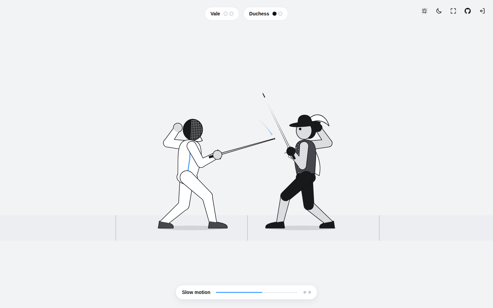
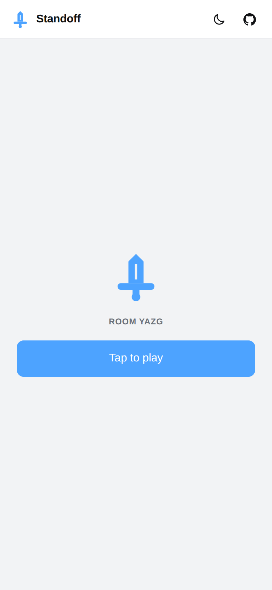

# Standoff

Standoff is a 1v1 fencing game for two people and one computer. Each player's phone becomes their sword. Point the phone and the blade on screen points with it. Thrust it to jab, snap it back to parry, and push your arm out to advance down the strip. The computer shows the strip, referees every touch and replays each point. First to two touches wins.

There is nothing to install on the phones and no account to make. Open the site on a computer, press Create game, and both players scan the QR code. It runs on Vercel for play from anywhere, or on your own computer over WiFi. Nothing is saved: close it and the game is gone.

Play it at [standoff-five.vercel.app](https://standoff-five.vercel.app).

## Screenshots

The start screen, in light and dark mode.


After Create game the whole window is the strip. The QR code waits in the middle, and players appear on their lines as they pick fencers.


A parry turning a jab away, and a lunge landing.


Every touch gets a replay, slowed down around the moment it lands, then the result.




On the phone: one tap to start, pick a fencer, then fence.

<p>
  
  
  
</p>

## How to play

1. On the computer, press **Create game**. Both players scan the QR code and tap **Tap to play**.
2. Pick a fencer. Hold the phone like a sword handle, screen up, top edge pointing at the computer, and tap **Calibrate**, then **Ready**.
3. Fence:
   * **Aim** by pointing the phone. A jab only lands if your tip points at your opponent.
   * **Jab** with a short, fast thrust forward.
   * **Parry** with a short, fast snap back toward you. For one second any jab that reaches you is blocked and the attacker is knocked off balance.
   * **Advance** by pushing your arm out and holding it there. Pull it in and hold to retreat.
4. Each touch gets a replay, which both players can skip. First to two wins. A rematch needs no new scan.

A device without motion sensors (a laptop joining to test, say) can play with on screen Jab and Parry buttons and a footwork slider.

## Running it

There are two ways to run Standoff, and they share all their code.

### On Vercel

1. Import this repository into Vercel. It builds as a normal Next.js app.
2. In the project, open **Storage**, add **Upstash for Redis** from the Marketplace and connect it to the project. That sets `REDIS_URL`.
3. Redeploy, so the new variable reaches the functions.

Redis is what lets the host and the two phones find each other. On Vercel each WebSocket is held by one function instance, and the three connections may land on three different instances. Without Redis the host shows *No shared room store* and roughly one join in five fails to find the room (phones retry a few times, so it usually still works, just not always). WebSockets need Fluid compute, which is on by default for projects created since April 2025.

On the Hobby plan Vercel ends every socket after five minutes. The server warns each client 30 seconds early, and the client moves to a fresh socket without dropping the game (see *Socket handover* below), so a match never notices.

### On your own computer

You need Node 20.9 or newer, with the computer and both phones on the same WiFi.

```bash
npm install
npm run dev
```

The terminal prints two addresses:

```
Open on this computer:  http://localhost:3000
Phones join through:    https://192.168.1.20:3443
```

Open the first one on the computer. The QR code already points at the second one.

Phones only share motion sensor data with pages served over HTTPS, so the phone side runs on HTTPS with a certificate the server makes for itself on first start. Each phone shows a warning the first time. On iPhone tap *Show Details*, then *visit this website*. On Android Chrome tap *Advanced*, then *Proceed*. The certificate is kept in `certs/`, so this happens once per network address. To skip the warning, make a trusted certificate with [mkcert](https://github.com/FiloSottile/mkcert), install its root on the phones, and save the pair as `certs/key.pem` and `certs/cert.pem`.

Public and guest WiFi usually stop devices from reaching each other, so on those networks use the Vercel version instead. If the QR code shows the wrong address (a VPN, for example), start with `PUBLIC_HOST=192.168.1.20 npm run dev`.

| Command | What it does |
| --- | --- |
| `npm run dev` | Local server with hot reload |
| `npm run build` | Production build |
| `npm start` | Local production server |
| `npm test` | Unit tests |
| `npm run typecheck` | TypeScript check |
| `npm run lint` | ESLint |

| Variable | Default | Purpose |
| --- | --- | --- |
| `REDIS_URL` | none | Shared room store. Set by the Vercel Redis integration. `KV_URL` also works |
| `PORT` | `3000` | Local HTTP port for the computer |
| `HTTPS_PORT` | `3443` | Local HTTPS port for the phones |
| `HOST` | `0.0.0.0` | Local interface to listen on |
| `PUBLIC_HOST` | LAN address | Address put in the QR code locally |
| `SOCKET_LIFETIME_MS` | off | Cuts local sockets after this long, like Vercel, to try the handover |

## How it works

### The pieces

The computer's browser tab is the referee. It runs the match, draws the strip and plays the sound. Each phone reads its own sensors, turns them into sword angles, footwork and strikes, and streams the result to the host. Everything a phone shows comes back from the host as one small state message, so a phone that reconnects is up to date on the first message it gets.

Between them sits a relay that makes no game decisions. It seats players, remembers who holds which seat, and passes messages along. The same relay runs in both places. Locally, one Node process (`server/index.ts`) serves the pages and accepts sockets at `/api/ws`, and rooms live in memory. On Vercel, a Next.js route at `src/app/api/ws/route.ts` accepts each socket with `experimental_upgradeWebSocket` from `@vercel/functions`, and rooms live in Redis.

### The relay

The seat rules are plain functions over a small room record (`src/relay/room-state.ts`): the lowest free seat goes to the next phone, a known seat token gets its old seat back, and a seat or a room is kept for a grace period after its player drops. Two things sit under those rules:

* A **store** that updates one room atomically. In memory that is free. In Redis each update takes a short lock on the room, reads the record, applies the same rules and writes it back, so two instances racing to seat two phones can never both put them in seat one.
* A **bus** for messages. In memory it is a local pub/sub. In Redis it is Redis pub/sub, with one subscriber connection per instance that fans messages out to the sockets it holds.

Each socket is one `RelayConnection` (`src/relay/relay-connection.ts`). It handles its messages one at a time in arrival order and never talks to another socket directly, only to the store and the bus. When a phone reloads and reclaims its seat on a different instance, the relay sends a kick over the bus and the old socket closes itself. If the host drops and never comes back, the phones' own connections close the room after the grace period, because on Vercel there is no central process to run that timer.

Every frame is validated with zod and rate limited per socket. Seat and host tokens live in session storage, never in a URL.

### Socket handover

Vercel ends every function at its maximum duration, sockets included. The route reads the real cutoff with `getDeadline()`, and the relay sends the client `server:rotate` 30 seconds before it. The client (`src/net/socket-client.ts`) then opens a second socket and rejoins on it. Outgoing messages switch to the new socket as soon as it opens, because the relay queues them behind the rejoin. Incoming messages switch once the new socket confirms the seat. Until then the old one keeps delivering, so nothing is lost or doubled. The relay kicks the old socket once the new one holds the seat, and the host never sees the player leave. Start the local server with `SOCKET_LIFETIME_MS=36000` to watch it happen every few seconds.

To stay inside the free Redis quota, a phone only sends a motion frame when the reading actually changed, plus a keepalive four times a second. Jabs and parries go out the instant they are detected.

### Sword tracking

The phone's orientation (`deviceorientation`) becomes a quaternion, and the phone's top edge rotated by it is the blade direction. Calibration stores that direction as the guard. From then on the blade's elevation and swing relative to the guard drive the sword on screen every frame. It reads an angle directly, so there is nothing to drift. Swinging the blade toward or away from the camera foreshortens it and dips the tip a little, which is how circling the phone shows up as the blade circling in a side view.

### Jabs and parries

Acceleration (`devicemotion`, with gravity removed) is rotated into the earth frame and projected onto the strip line, the level direction the phone pointed at when calibrating. So a thrust counts the same with the tip high or low.

A jab is that signal climbing from quiet past the jab threshold within 160 ms. A parry is the same thing backwards. The rise window is what keeps a slow push of the arm reading as footwork instead of a strike. Both are edge triggered, and after either one the detector ignores everything for a short refractory period, because every jab ends with the arm braking and every parry ends with it springing back, and those recoveries look exactly like the opposite strike.

### Footwork

Forward acceleration is integrated twice into how far the arm is from where it started. That offset maps straight to walking speed, with a small deadzone around centre, so holding your arm out keeps you advancing at a steady pace for as long as you hold it.

Double integration drifts, so two things keep it honest. When the phone has been still for about 200 ms, velocity snaps to zero, which stops sensor noise from building up while the arm is held. And every en garde zeroes the offset, so whatever drift remains lasts one exchange at most. Strikes are cut out of the integration too: when a jab fires, tracking rewinds to where the arm was before the thrust began.

Movement sits behind one interface in `src/motion/movement/`. If position tracking feels unreliable, switch the tuning drawer to **Tilt**, where twisting the wrist sets the speed instead. It reads an angle directly, so it cannot drift.

### The referee

The host steps the match at a fixed 60 Hz. A jab does not land when it is detected: the tip takes 140 ms to arrive, and the defender's parry window is checked at the moment of arrival. That gap is what lets a fast reaction save a touch. A jab also has to be in range and on target (the live blade pointing within 55 degrees of the line). Two touches within 60 ms of each other cancel out, like a double in épée. If both fencers walk into each other, it is called corps-à-corps and they are put back at a safe distance.

### Fencers and characters

Every fencer is a cutout rig: separate art pieces for the head, torso, arms, legs and sword, hung on one skeleton and drawn with canvas paths. A pose is a handful of numbers (hip position, lean, where each foot and hand is, blade angle). Knees and elbows are solved with two bone IK, so poses stay small enough to blend field by field.

The sword arm follows the phone. Jabs, parries, deflections, hits, and the victory and defeat poses are layered on top by a small animator. Each action has a weight that snaps toward 1 when it starts and eases back to 0 after, which is how a lunge briefly takes over the tracked sword and then springs back to following your hand. The feet step in time with distance travelled, so a retreat plays the same step backwards, back foot first, which is how fencers actually retreat.

The four characters (Vale, Duchess, Marrow, Iron) share that skeleton and animation. A character is only a choice of art pieces and tones, so all of them stay fully reactive. Player one's details are drawn in the accent colour and player two's in white.

### Replays

While play is live the engine records every frame (positions, blade angles, the current action and how far into it) and every event. A frame is a few numbers, so seconds of history cost almost nothing, and there is no video. After a touch the replay feeds the last three seconds back through the same renderer, slowing to 30 percent around the touch and interpolating frames so the slow part stays smooth. It ends when it finishes, when both players skip, or after the timeout, so a phone that drops out cannot stall the match.

### Sound

All of it is synthesized with the Web Audio API, so there are no audio files. Four buses (music, crowd, effects, interface) feed a limiter. Each combat sound fires off the same game event that starts the animation, so they land on the same frame. The music is two step sequenced loops, an ambient one for the lobby and a driving one for the match, scheduled ahead on the audio clock. It ducks under cheers and drops right back during replays.

The crowd murmurs under the whole match. Cheers are rationed on purpose: only a clash (both fence at once and one parries) or a match point earns one, with a cooldown between them.

iOS will not start audio or share motion until the user taps, so the phone's first screen does both in a single tap, along with a screen wake lock. Haptics use `navigator.vibrate`, which works on Android. iOS Safari has never supported it and the old checkbox trick was closed in iOS 26.5, so on iPhones the computer's sound carries the feedback.

### Tuning

Every value worth adjusting by feel is in the tuning drawer (the sliders icon at the top right of the stage). Changes reach both phones at once. Nothing is saved, so a new game starts from the defaults.

| Setting | Default | What it changes |
| --- | --- | --- |
| Jab threshold | 14 m/s² | How hard a thrust has to be |
| Parry threshold | 12 m/s² | How hard a pull back has to be |
| Parry window | 1000 ms | How long a parry blocks |
| Refractory period | 350 ms | Quiet time after any strike |
| Movement model | Position | Position tracking or tilt |
| Stillness threshold | 0.35 m/s² | How still counts as still |
| Stillness time | 200 ms | How long before velocity resets |
| Offset for full speed | 0.18 m | How far out the arm goes for top speed |
| Offset deadzone | 0.03 m | Offset that still counts as standing |
| Tilt deadzone and full speed | 8° and 35° | The same, for tilt mode |
| Replay timeout | 10 s | When a replay ends on its own |
| Music, crowd, effects | 0.5, 0.6, 0.9 | Mix levels |
| Cheer cooldown | 8 s | Minimum gap between cheers |

These are starting points. Expect to move them once two people are actually playing.

## Project layout

```
server/                 Local entry: Next, HTTPS for phones, upgrades to the relay
  realtime/             Local WebSocket server and the optional socket lifetime
src/
  app/                  Next routes: the host page, /join/[code], and /api/ws for Vercel
  relay/                Rooms and message routing, with memory and Redis backends
  shared/               Protocol schemas, tuning, characters, shared types
  motion/               Phone side sensor processing, no browser APIs
    movement/           Position tracking and the tilt fallback
  game/                 Host side engine: fencers, referee, match, replay
  rig/                  Skeleton, IK, poses, animator, art pieces, skins
  render/               Canvas renderer, camera, strip, hit flash
  audio/                Web Audio engine, effects, crowd, music, director
  net/                  WebSocket client with reconnects and the socket handover
  host/                 Host session, lobby and the full screen stage
  controller/           Phone session, sensors and screens
  components/           Shared interface pieces
  styles/               Stylesheets per area
```

The motion, game, rig and relay folders have no DOM code in them, which is what lets the tests drive them with synthetic sensor readings, scripted matches and fake sockets.

## Tests

```bash
npm test
```

The suite covers the relay (seating, ordering, kicks, grace periods and closing), the Vercel route run against the real upgrade helper, the motion pipeline fed with synthetic sensor data, jab, parry and footwork detection, the referee, match flow, replay timing, the engine playing whole exchanges, the rig's IK and animator, the lobby rules, tuning clamps and protocol validation.

One more test runs the relay against real Redis with two separate backends standing in for two Vercel instances. It runs when `REDIS_TEST_URL` is set:

```bash
redis-server --port 6390 --daemonize yes
REDIS_TEST_URL=redis://127.0.0.1:6390 npm test
```
