# Standoff

Standoff is the games console of the web. Open it on any computer, and everyone's phone becomes a controller that tracks how they move. Some games use the computer's camera instead and read you from the waist up. Play with up to six friends across eleven games, each one its own world.

I loved the Wii, the PS5 and the Xbox, but there were never enough controllers, and I can't bring my Xbox everywhere. Standoff runs on any computer and uses everyone's phones as controllers. There is nothing to install and no account to make: pick a game, everyone scans the QR code, types a name, and you play.

Camera games track movement with a pose model that downloads once and runs on your own computer. The camera picture never leaves it. Phones send their moves through the game server as you play, and nothing is ever saved there: close the game and it is gone.

The games, in the order the home screen shows them:

* **Magic Kart:** a kart racer for up to four in split screen. Hold the phone like a steering wheel, grab power ups, and glide over the big jumps.
* **Fruit Ninja:** up to four players slice fruit on one board by pointing their phones at the screen, and dodge the bombs.
* **Zombie Survival:** up to four players aim their phones like guns and fight together through 25 stages to the ship.
* **Shooting Gallery:** a fairground duck shoot. Point, shoot, top score in 20 seconds wins.
* **Boxing:** stand in front of the camera and fight. Your arms and head drive your boxer, so real blocks and dodges work.
* **Subway Surfers:** run the neon rails with your body. Lean to change lanes, jump and roll, and survive as it speeds up.
* **NBA 3v3:** three on three with the stars for up to six phones. Dribble moves, a shot meter, dunks and free throws.
* **FIFA 3v3:** three on three football for up to six phones. Hold to power a shot, tap to pass, and beat defenders with skill moves.
* **Cube Game:** jump for real to jump the cube through five levels of rhythm and spikes.
* **Blade Clash:** a split screen sword duel for two. Your phone is the sword in full 3D. Swing, block and clash until one fighter has taken five hits.
* **Brawl Battle:** a four fighter platform brawl. Charge up attacks, pile on the damage and knock everyone off the stage.

Empty spots are filled by computer players. Each game lives in its own folder under `src/games`, with a README of its own.

It runs on Vercel for play from anywhere, or on your own computer over WiFi.

Play it at [standoff-five.vercel.app](https://standoff-five.vercel.app).

## Screenshots

The home screen works like a console menu. Big tiles show each game, and the chosen one grows and gets a ring in its own colour. A looping clip of the game really being played fills the screen behind it, with lobby music and menu sounds. The gear at the top right sets the music and sound effect volume.

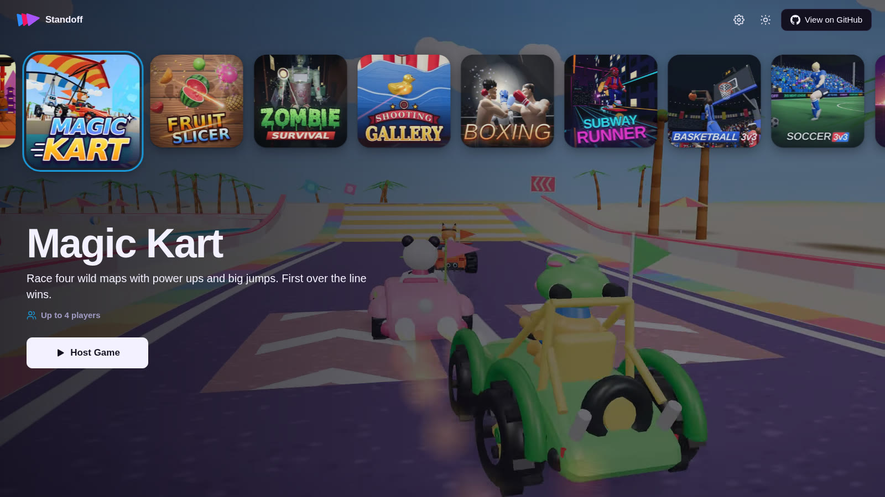

### Magic Kart

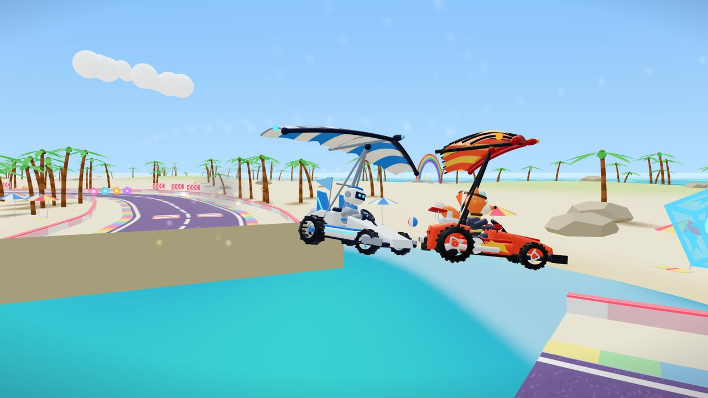

### Fruit Ninja

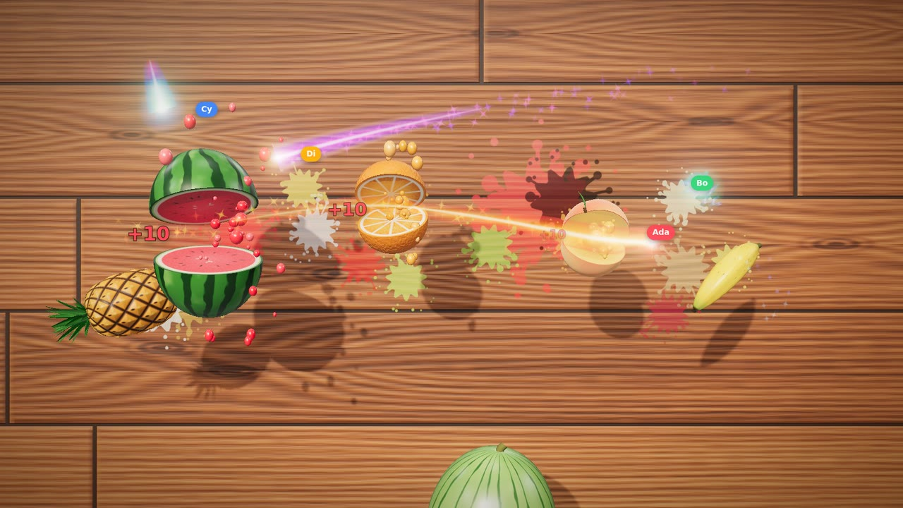

### Zombie Survival

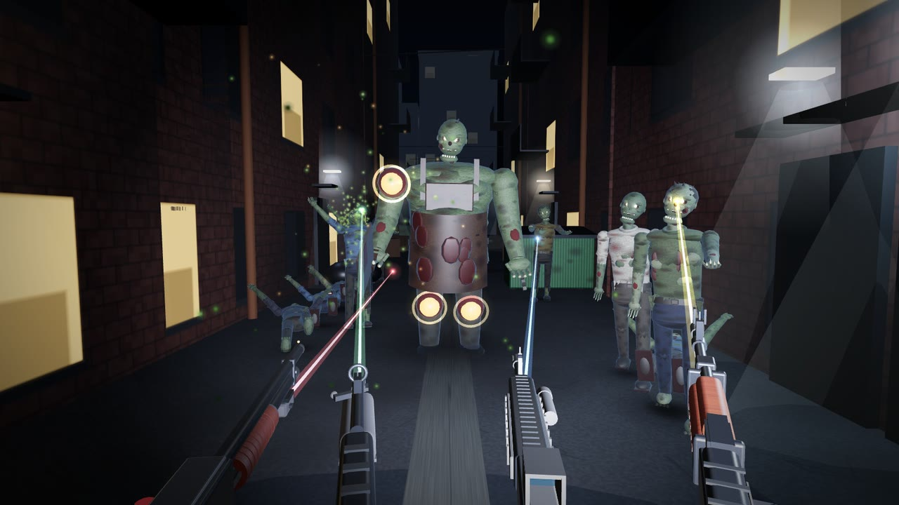

### Shooting Gallery

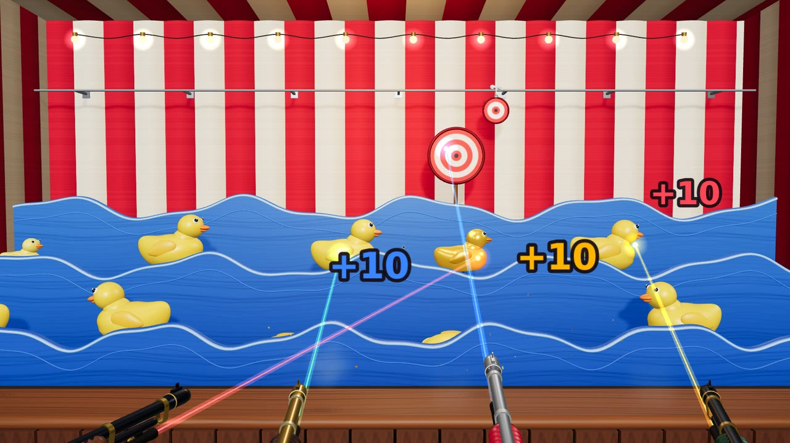

### Boxing

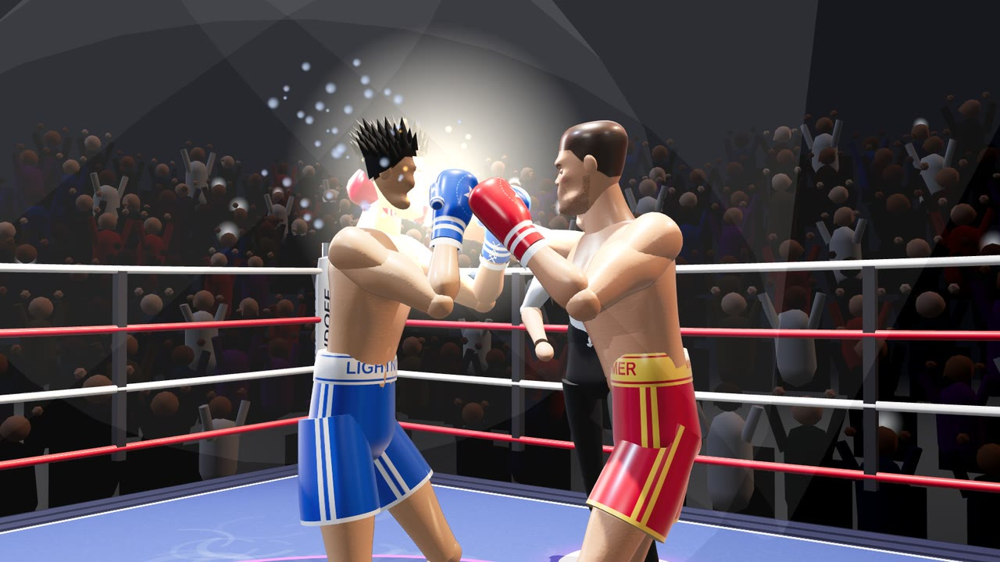

### Subway Surfers

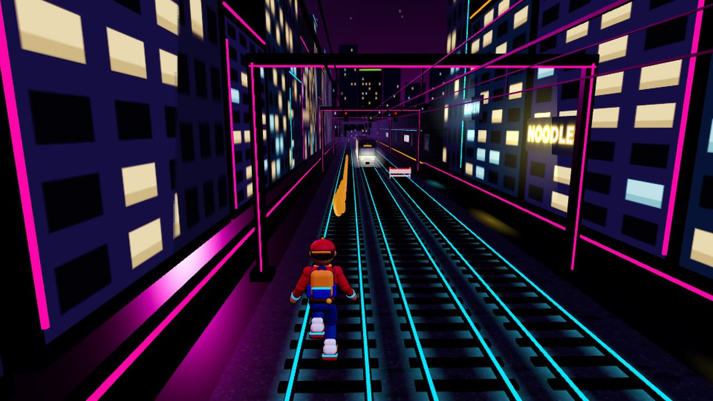

### NBA 3v3

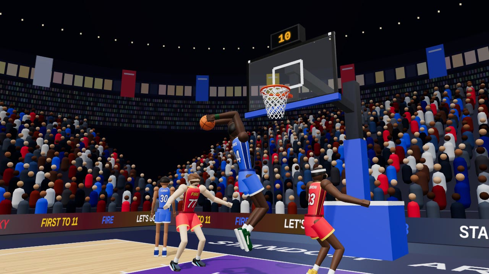

### FIFA 3v3

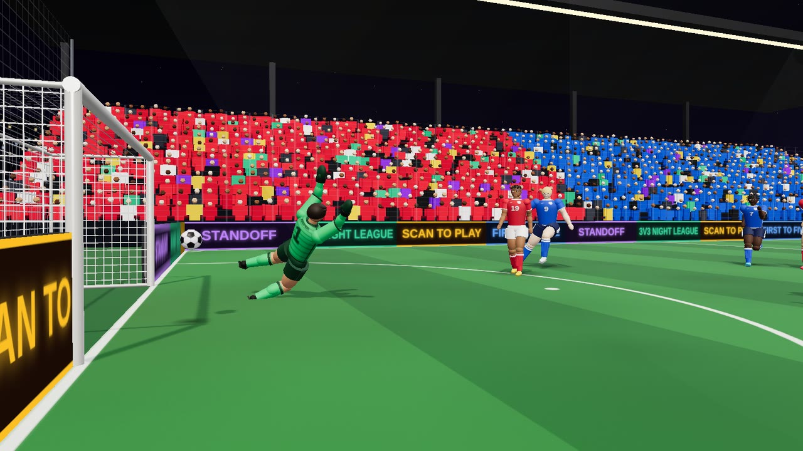

### Cube Game


### Blade Clash

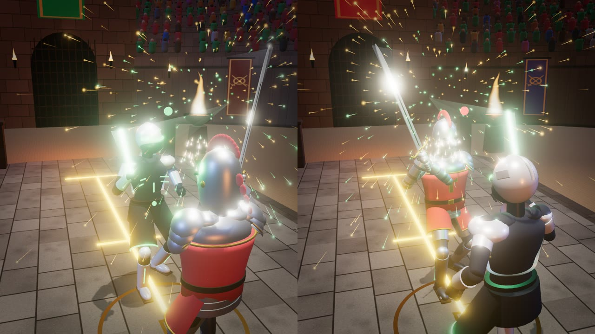

### Brawl Battle

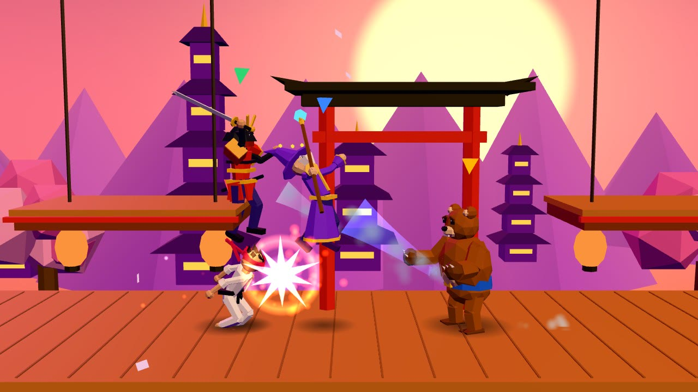

## How to play

On the computer, pick a game and press **Host Game**. Scan the QR code with each phone, type a name and tap **Join**, or tap **Skip**. Every game walks the phone through the same steps, each on its own page: calibrate, the game's own choice, then **Ready**. Every phone page fits the screen without scrolling.

Camera games have no phones. Stand where the camera sees you from the waist up, hold still while your head line is set, and play with your body. Your head going up out of its band is a jump, and going down is a duck or roll.

* **Magic Kart:** hold the phone sideways like a wheel and turn it to steer (full lock at about 50 degrees). Hold **Drive** to go, **Brake** to slow and drift, and tap the round button to use a power up. Off a big jump a glider opens, and you steer it the same way.
* **Fruit Ninja, Zombie Survival and Shooting Gallery:** hold the phone flat like a remote and point it at the screen. Calibrate by pointing at the targets shown. Sweep fast to slice, or tap **Shoot**. Phones without motion sensors aim by dragging on a pad.
* **Boxing:** punch straight or hook with your arms. Keep your gloves where the punch is coming to block it, and duck or lean to make it miss. Head shots hurt more and can stun. Touch gloves by holding your arms out.
* **Subway Surfers:** lean or step left and right to change lanes, jump to jump and dip to roll.
* **NBA 3v3:** the joystick moves. Hold **Shoot** and let go in the green. With the ball the third button is **Dribble**: back is a stepback, sideways a crossover, forward a spin. Without it, it is **Steal** or **Block**. Reach in too often on one player and you may foul.
* **FIFA 3v3:** the joystick moves and aims. Tap **Shoot/Pass** to pass, or hold it to fill the power bar. Green is placed, red is powerful but wild. With the ball the second button is **Skill**: forward is a rainbow flick, sideways a crossover, back a drag back, centred a 360.
* **Cube Game:** jump for real to jump the cube.
* **Blade Clash:** hold the phone like the handle of a sword and calibrate by pointing at the targets. The sword on screen copies it in 3D. A hit only counts when a moving blade really touches the other fighter, and a blade held in the way blocks it. Hold **Forward** or **Back** to move. To fight alone, tap **Play the computer**.
* **Brawl Battle:** the joystick moves, and pushing up jumps (push up again in the air to double jump). Attacks change with the direction you hold. Hold an attack past 0.4 seconds to charge a stronger move, and use the Ult when its ring is full. Two lives each, and more damage means you fly further.

## Running it

There are two ways to run Standoff, and they share all their code.

### On Vercel

1. Import this repository into Vercel. It builds as a normal Next.js app.
2. In the project, open **Storage**, add **Upstash for Redis** from the Marketplace and connect it to the project. That sets `REDIS_URL`.
3. Redeploy, so the new variable reaches the functions.

Redis is what lets the host and the phones find each other. On Vercel each connection is held by one function instance, and the three connections may land on three different instances. Without Redis some joins fail to find the room. Phones retry a few times, so it often still works, but not reliably. WebSockets need Fluid compute, which is on by default for projects created since April 2025.

Chrome and Firefox can only reach the game through the HTTP fallback on Vercel today (see *The HTTP fallback* below). That fallback leans on Redis even more, so treat Redis as required.

On the Hobby plan Vercel ends every socket after five minutes. The server warns each client 30 seconds early, and the client moves to a fresh socket without dropping the game (see *Socket handover* below), so a match never notices.

### On your own computer

You need Node 20.9 or newer, with the computer and the phones on the same WiFi.

```bash
npm install
npm run dev
```

The terminal prints two addresses:

```
Open on this computer:  http://localhost:3000
Phones join through:    https://192.168.1.20:3443
```

Open the first one on the computer. The QR code already points at the second one.

Phones only share motion sensor data with pages served over HTTPS, so the phone side runs on HTTPS with a certificate the server makes for itself on first start. Each phone shows a warning the first time. On iPhone tap *Show Details*, then *visit this website*. On Android Chrome tap *Advanced*, then *Proceed*. The certificate is kept in `certs/`, so this happens once per network address. To skip the warning, make a trusted certificate with [mkcert](https://github.com/FiloSottile/mkcert), install its root on the phones, and save the pair as `certs/key.pem` and `certs/cert.pem`.

Public and guest WiFi usually stop devices from reaching each other, so on those networks use the Vercel version instead. If the QR code shows the wrong address (a VPN, for example), start with `PUBLIC_HOST=192.168.1.20 npm run dev`.

| Command | What it does |
| --- | --- |
| `npm run dev` | Local server with hot reload |
| `npm run build` | Production build |
| `npm start` | Local production server |
| `npm test` | Unit tests |
| `npm run typecheck` | TypeScript check |
| `npm run lint` | ESLint |

| Variable | Default | Purpose |
| --- | --- | --- |
| `REDIS_URL` | none | Shared room store. Set by the Vercel Redis integration. `KV_URL` also works |
| `PORT` | `3000` | Local HTTP port for the computer |
| `HTTPS_PORT` | `3443` | Local HTTPS port for the phones |
| `HOST` | `0.0.0.0` | Local interface to listen on |
| `PUBLIC_HOST` | LAN address | Address put in the QR code locally |
| `SOCKET_LIFETIME_MS` | off | Cuts local sockets after this long, like Vercel, to try the handover |

## How it works

### The platform and the games

`src/platform` is the console: the home screen, rooms, joining, names, reconnects, and the frame around every game. Each game is a folder in `src/games` that plugs in through one contract, `src/platform/games/game-api.ts`. A game supplies a host screen for the computer and a phone screen, and exchanges messages of its own design with its phones. It never imports another game, so several games can be built at once without touching the same files. `src/games/README.md` explains how to add one.

The platform keeps two message kinds for itself. A phone sends `profile` with its player's name, and the host sends every phone `players`, the line up. Games never see either.

Inside a game, the computer is the referee. Phones send raw input, and everything they show comes back from the host.

### The relay

Between the computer and the phones sits a relay that makes no game decisions. It seats players, remembers who holds which seat, and passes messages along. It checks only that a message has a `kind` and fits the size cap, so a new game needs nothing from it. Locally, one Node process (`server/index.ts`) serves the pages and accepts sockets at `/api/ws`, and rooms live in memory. On Vercel, a Next.js route at `src/app/api/ws/route.ts` takes over each socket from the runtime, and rooms live in Redis. A second route, `/api/stream`, carries the same relay over plain HTTP for browsers whose WebSocket cannot open.

The seat rules are plain functions over a small room record (`src/platform/relay/room-state.ts`): the lowest free seat goes to the next phone, up to the one to six seats the game asked for, a known seat token gets its old seat back, and a seat or a room is kept for a grace period after its player drops. Two things sit under those rules:

* A **store** that updates one room atomically. In memory that is free. In Redis each update takes a short lock on the room, reads the record, applies the same rules and writes it back, so two instances racing to seat two phones can never both put them in seat one.
* A **bus** for messages. In memory it is a local pub/sub. In Redis it is Redis pub/sub, with one subscriber connection per instance that fans messages out to the sockets it holds.

Each socket is one `RelayConnection` (`src/platform/relay/relay-connection.ts`). It handles its messages one at a time in arrival order and never talks to another socket directly, only to the store and the bus. When a phone reloads and reclaims its seat on a different instance, the relay sends a kick over the bus and the old socket closes itself. If the host drops and never comes back, the phones' own connections close the room after the grace period, because on Vercel there is no central process to run that timer.

Every frame is validated with zod and rate limited per socket. Room creation and wrong room codes are capped per address, with the counters in the store so every instance shares them, and a room whose host has left gives its code back a minute later. A create, resume or join that fails part way, on a Redis error say, is undone and answered with an error the client retries. Seat and host tokens live in session storage and in the page, never in a URL or a log.

### Socket handover

Vercel ends every function at its maximum duration, sockets included. The route reads the real cutoff with `getDeadline()`, and the relay sends the client `server:rotate` 30 seconds before it (a third of the life, for shorter ones). The client (`src/platform/net/socket-client.ts`) then opens a second socket and rejoins on it. Outgoing messages switch to the new socket as soon as it opens, because the relay queues them behind the rejoin. Incoming messages switch once the new socket confirms the seat. Until then the old one keeps delivering, so nothing is lost or doubled. The relay kicks the old socket once the new one holds the seat, and the host never sees the player leave. If the new socket dies before confirming, whatever went out on it is sent again on the old one. Start the local server with `SOCKET_LIFETIME_MS=36000` to watch it happen every few seconds.

### The HTTP fallback

Chrome and Firefox open a WebSocket over the page's existing HTTP/2 connection whenever the server allows it, and Vercel's edge does. Those WebSockets currently fail at the edge with a 502, before our code ever sees them. Vercel's own WebSocket demo fails the same way. Safari opens WebSockets over HTTP/1.1, so iPhones are not affected.

So when a WebSocket fails before it ever opens, the client switches to an HTTP stream for good (`src/platform/net/stream-channel.ts`). A Server-Sent Events stream from `GET /api/stream` carries messages down. Messages going up are batched into `POST /api/stream`, one request at a time so they arrive in order, with whatever queued meanwhile riding in the next one. The stream behaves like a socket to the relay, handover included. A POST may reach any instance, so it travels to the stream's instance over the Redis bus. Without Redis about half the posts land on the wrong instance. Each of those is retried a few times, which helps, but Redis is the real fix. Set `standoff:transport` to `stream` in local storage to try the fallback anywhere.

To stay inside the free Redis quota, a phone only sends a motion frame when the reading actually changed, plus a keepalive four times a second. Strikes go out the instant they are detected.

## Blade Clash

Everything in this section lives in `src/games/blade-clash`, and its own README goes further.

### The sword

Each phone is the handle of a sword. It reads its orientation (`deviceorientation`) and learns the grip at calibration: the player points at the middle of their half of the screen, then at each corner, then shows a relaxed guard. From then on the phone sends how the sword is held, turned, raised, the edge's angle and how far the arm reaches. The computer puts the hand and the blade in the world from that, so the sword on screen moves in full 3D with the phone. Footwork is two hold buttons, **Forward** and **Back**, which leaves the sensors free for the sword.

### Hits and clashes

There are no gestures. A hit is a moving blade passing through the other fighter's head, body or legs. Each swing is tested along its whole path in steps no longer than a blade is thick, so a swing too fast to see in one frame still hits what it went through. Blade against blade is tested first, so a blade held in the way stops a swing. Blades that meet fast enough clash: sparks, a clang, and both swords are thrown back before they ease into the hand again. Each fighter can take five hits.

### The look

The screen is split down the middle, one shoulder camera per player, each with its own bloom. Four fighters share one skeleton with inverse kinematics: the Knight with a longsword, the Samurai with a katana, the Block Hero with a pixel sword and the Star Knight with a glowing energy blade. The arena is an open air stone dais under a full house. Blades leave trails, clashes throw sparks in the blades' colours, and the last hit plays in slow motion before the winner raises their sword under confetti. Each half has its player's card with five health blades, with the split map between them.

### Sound

All of it is synthesized with the Web Audio API through four buses (music, crowd, effects, interface). There is lobby and fight music, a whoosh, clash and hit in each weapon's own voice, the energy blade's hum, clanking armour, and a crowd that gasps at big clashes and cheers the finish.

### Tuning

The tuning drawer (the sliders icon at the top right) holds the hit and clash speeds, the knockback, the cooldowns and the mix. Nothing is saved.

## Project layout

```
server/                   Local entry: Next, HTTPS for phones, upgrades to the relay
src/
  app/                    Next routes: the home page, /join/[code], /api/ws and /api/stream
  platform/               The console, shared by every game
    games/                The contract between the platform and a game
    host/                 Home screen, room shell, join card, the host's room
    phone/                Name screen, joining, the phone's room, permissions
    relay/                Rooms and message routing, with memory and Redis backends
    net/                  Socket client with reconnects, the handover and the HTTP fallback
    protocol/             The envelopes every frame travels in
    audio/                The Web Audio engine
  games/
    catalog.ts            Every game and how to load it
    kit/                  Shared code games may use: phone aiming, setup steps, seat colours
    blade-clash/          Sword duel in split screen, three.js
    fruit-ninja/          Slicing on a wooden board, three.js
    magic-kart/           Kart racing in split screen, three.js
    zombie-survival/      Co-op zombie shooter over 25 stages, three.js
    shooting-gallery/     Fairground duck shoot, three.js
  components/             Shared interface pieces
  styles/                 The platform's stylesheets. Each game keeps its own.
```

## Tests

```bash
npm test
```

The suite covers the relay (seating up to six, ordering, kicks, grace periods, closing, store failures and rate limits), both Vercel routes, the socket handover, the platform's host room and names, the game catalog, and for Blade Clash the motion pipeline fed with synthetic sensor data, calibration and aiming, the swept blade tests, clashes and knockback, the engine playing whole exchanges, match flow with the slow motion finish, the computer opponent, the rig, footwork and endings, the lobby, and the showcase's beats. The kit's aim math and phone aiming are tested too. Each three.js game tests its own engine: Fruit Ninja's blade sweeps and scoring, Magic Kart's laps, checkpoints, items and whole computer races on every map, Zombie Survival's guns, stages and a bot team playing all 25 stages, and Shooting Gallery's rounds, hit tests and best scores.

Two more files run against a real Redis: the relay with two separate backends standing in for two Vercel instances, and the store's locking and expiry. They run when `REDIS_TEST_URL` is set:

```bash
redis-server --port 6390 --daemonize yes
REDIS_TEST_URL=redis://127.0.0.1:6390 npm test
```
