# Standoff

**Standoff turns any computer into a games console, and every phone in the room into a controller.**

Open it on a laptop or a TV. Everyone scans the QR code, types a name, and plays. There is nothing to install and no account to make. Race karts by turning your phone like a wheel. Swing it like a sword. Aim it like a paint marker. Or put the phone down, step in front of the camera and box with your own fists. Up to six friends, thirteen games, one big screen.

**Play it now at [standoffgames.vercel.app](https://standoffgames.vercel.app).**

I loved the Wii, the PS5 and the Xbox, but there were never enough controllers, and I can't bring my Xbox everywhere. Everyone already carries a phone full of motion sensors, and almost every laptop has a camera. Standoff puts them to work.

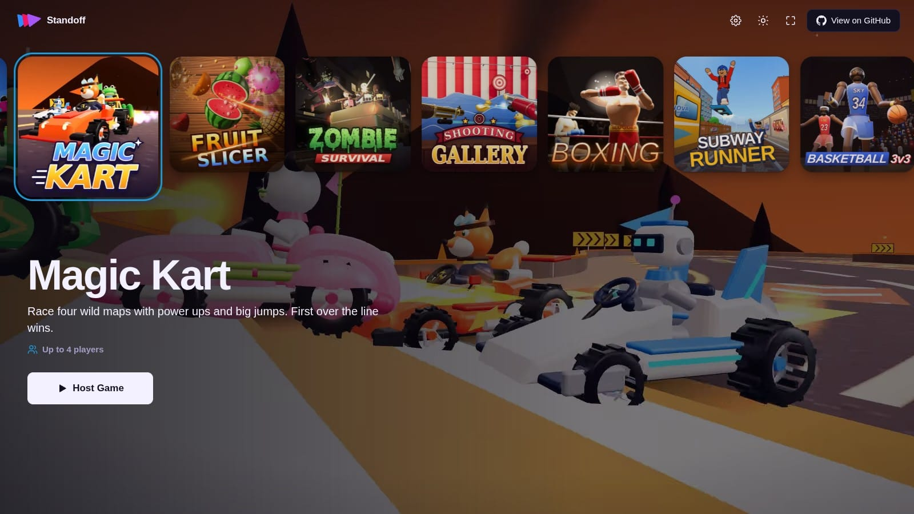

The home screen works like a console menu. Big tiles show each game, and the chosen one grows and gets a ring in its own colour. A clip of the game really being played fills the screen behind it, with a warm lobby tune and menu sounds. Arrow keys, clicks or taps move along the row, and it loops round like a carousel.

## How to play

1. **Pick a game** on the computer and press **Host Game**.
2. **Join with your phone.** Scan the QR code, or open the site on the phone and type the four letter code. Type a name and tap **Join**.
3. **Set up.** Each phone walks through the same few pages: calibrate, the game's own choice (a kart, a gun, a build, a fighter), then **Ready**. Every page fits one phone screen without scrolling.
4. **Play.** The computer is the big screen and the referee. The phones are the controllers.

**Phone games** use the phone in one of three ways:

* **As a pointer.** Hold it flat like a remote and aim at the screen: Fruit Slicer, Zombie Survival, Shooting Gallery and Paintball Battle.
* **As a sword.** Hold it like the handle and swing: Blade Clash.
* **As a wheel.** Hold it sideways and turn it: Magic Kart.
* **As a gamepad.** Hold it sideways with a stick under the left thumb and buttons under the right: Basketball 3v3, Soccer 3v3, Football 3v3 and Brawl Battle.

**Camera games** need no phones at all: Boxing, Subway Runner and Cube Game. Stand where the computer's camera sees you from the waist up and play with your body. A pose model downloads once and runs on your own computer, and the camera picture never leaves it.

Empty places are filled by computer players, so one person can always play.

## The games

In the order the home screen shows them.

### Magic Kart


Split screen kart racing for up to four. Turn your phone like a steering wheel, brake into a bend to drift, and fire a blue, orange or purple mini turbo out of it. Grab Star Orbs, Nitro, Ice Blasts, Vanish and Shields from the glowing cubes. Launch off the big jump on every map and a glider unfolds over your kart, so you steer through the air. Four wild maps: Sunny Shores, Star Ring, Neo City and Magma Peak. The top three lift their cups on a podium under confetti.

### Fruit Slicer

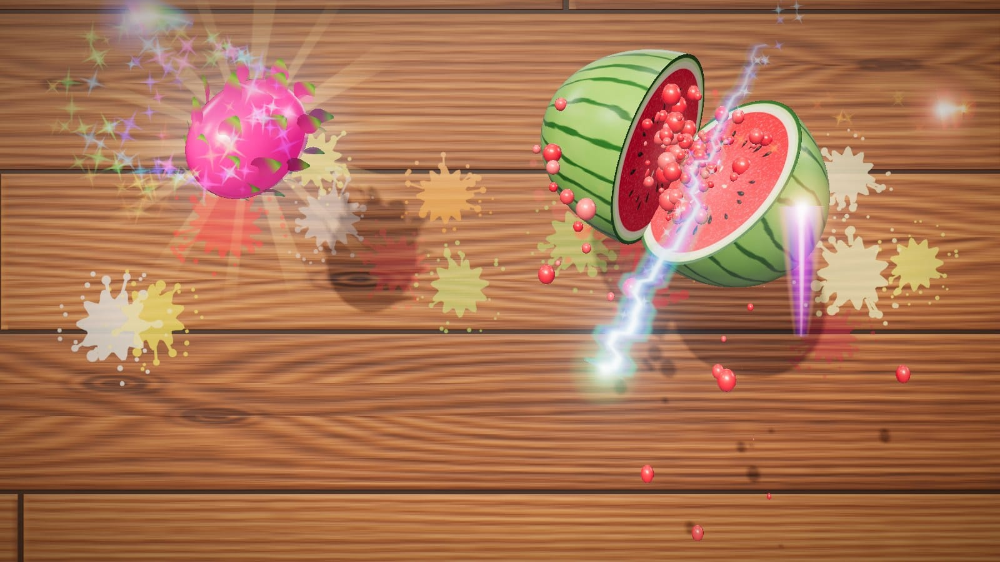

Up to four blades on one board. Point your phone at the screen and swing fast to slice. Chain combos, crack giant melons with several hits, chase rare star fruit and glowing dragonfruit, and dodge the bombs. Pick your slash from seven styles, from Plasma to Gold. Top score when the clock runs out wins.

### Zombie Survival

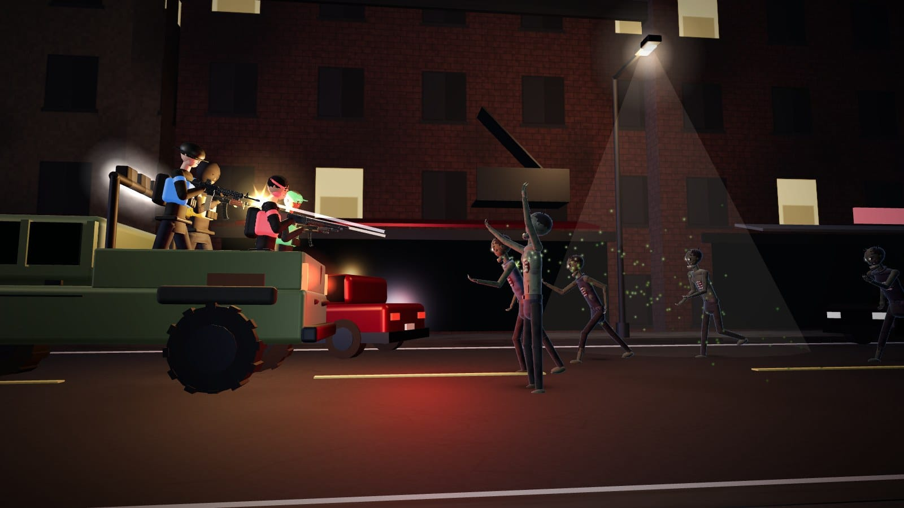

A team shooter on rails for up to four. Each phone is a gun: Shotgun, Submachine Gun, Assault Rifle or AK-47, each with its own crosshair and kick. Fight through fifteen stages of a foggy dead city, shoot the glowing weak points on the Butcher, the Surgeon and the Juggernaut, get lifted off the hospital roof by helicopter at stage 10, and make it to the ship at stage 15.

### Shooting Gallery

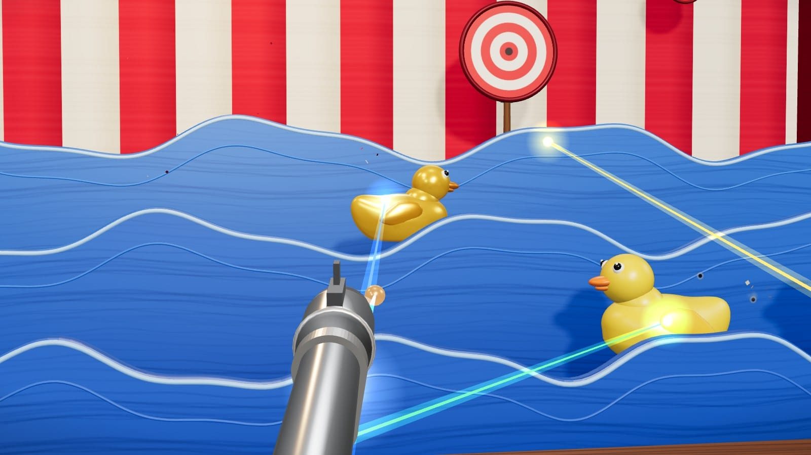

A fairground duck shoot for up to four. Point your phone, tap Shoot, and pump your BB gun between shots. Ducks are 10, a bullseye's red centre 40, plates on the top rail 30 and the rare golden duck 50. Everything speeds up as the round goes on. The best scores stay on this computer.

### Boxing

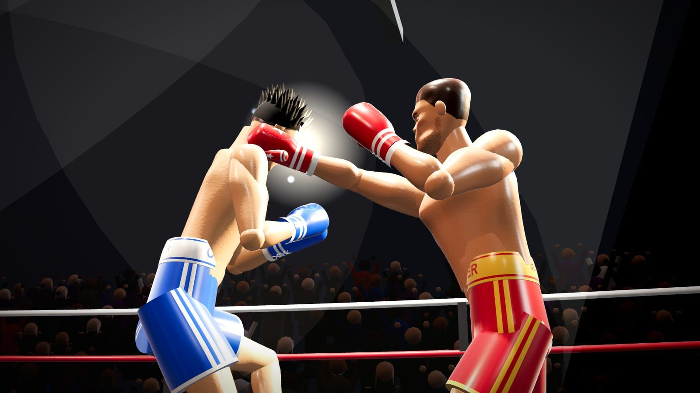

Stand in front of the camera and fight. Jabs, crosses, hooks and body shots come straight from your arms. Block with your real gloves, duck and slip with your real head, then counter. Four builds (Slugger, Out Boxer, Counter Puncher, Swarmer), stuns and knockdowns, four rounds with breaks on the stool, and a championship belt raised under cannons of confetti. Fight a friend side by side in split screen, or the computer.

### Subway Runner

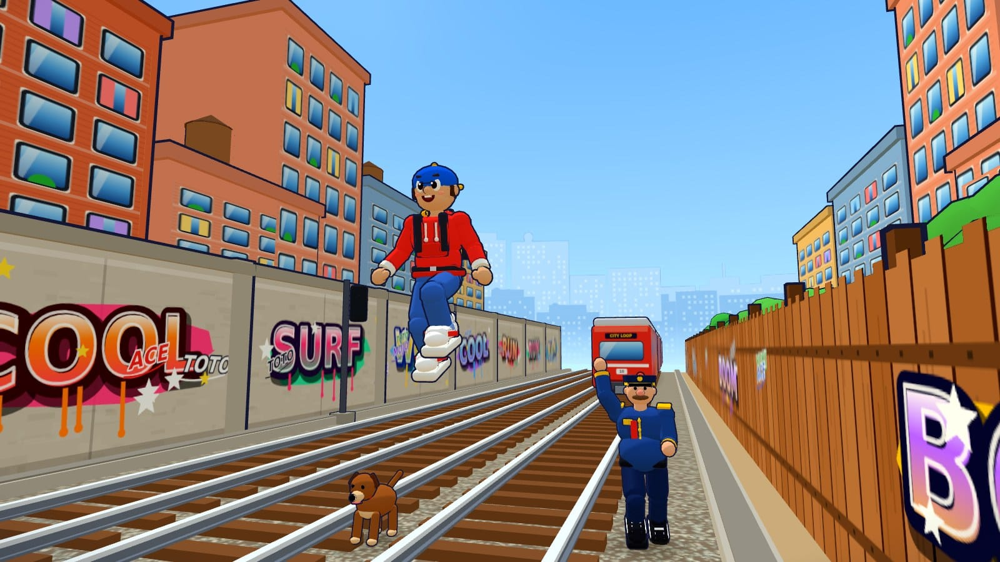

An endless runner played with your body. Lean to change tracks, jump over barriers, duck to roll under them, and run along the roofs of the trains while the inspector and his dog give chase. Pick Easy, Medium, Hard or Demon for a bigger score multiplier, or play with the keyboard. Every run goes on the leaderboard on this computer.

### Basketball 3v3

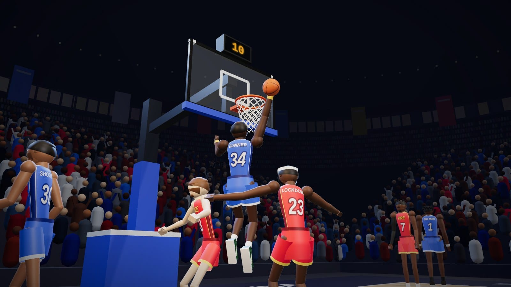

Three on three half court for up to six phones. Pick one of six builds, hold Shoot and let go in the green, and break ankles with stepbacks, crossovers and spins. Dunks, reverse layups, blocks at the top of the jump, steals, fouls and free throws. First to 11 wins, the winning basket replays in slow motion, and the captain lifts the trophy at centre court.

### Soccer 3v3

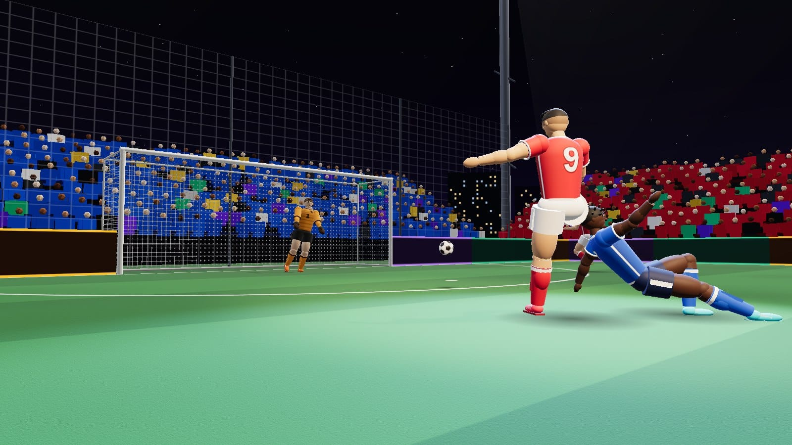

Three on three football on a big floodlit pitch with a keeper in each goal. Tap to pass, hold to fill the power bar and shoot, and let the curl bend it round the keeper. Beat your man with a rainbow flick, a crossover, a drag back or a 360. Slide tackles, free kicks, penalties, goal replays and golden goal, then the winners lift a World Cup style trophy.

### Football 3v3


Three on three American football under the lights, with computer linemen battling at the line. The QB calls Throw, Run or Kick, hikes it and throws a spiral with the throw stick. Runners juke and dive, defenders rush, cover and tackle. Touchdowns replay like a TV broadcast, and the captain lifts a silver football on a kicking tee at midfield. First to 14 wins, or the lead after four quarters.

### Cube Game

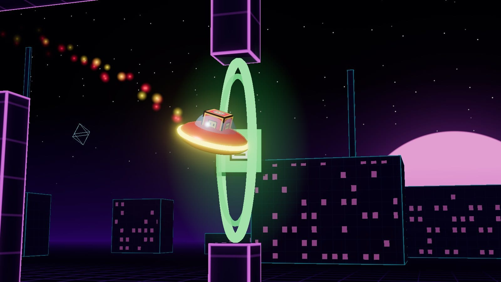

A rhythm platformer played by jumping for real. Your jump is the cube's jump, on the beat of each level's own song. Portals turn you into a UFO or a ball that flips gravity. Seven levels from First Light up to two Demon levels, a practice mode with checkpoints, a split screen 1v1 race, and a leaderboard for every level.

### Blade Clash

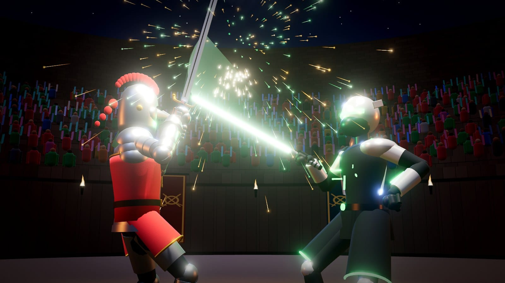

A sword duel where your phone is the sword. It moves in full 3D on screen as you move it: swing, thrust, and hold your blade in the way to block. Blades that meet clash in sparks. Four fighters (the Knight, the Samurai, the Block Hero and the Star Knight), a split screen view over each shoulder, slow motion on every hit, and first to five wins. Play a friend or the computer.

### Brawl Battle

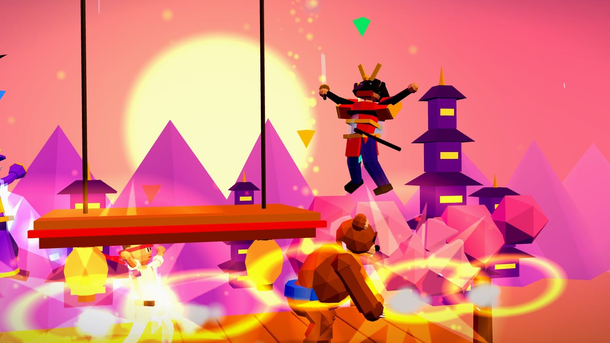

A platform fighter for up to four. Karate, Samurai, Mage and Bear each have quick moves, specials, five charged moves and an ult. Pile on the damage, then knock everyone off one of four stages: Dojo Rooftop, Floating Temple, Crystal Cave and Forest Treetop. Two lives each, last fighter standing wins.

### Paintball Battle

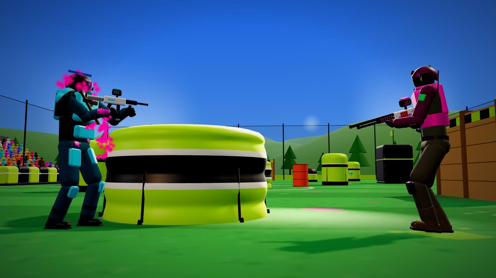

Team paintball for up to four, one or two a side. Your fighter runs from bunker to bunker by itself. You point your phone to aim, hold Crouch to hide, and rise to splat the other team with a Paint Rifle, Shotgun, SMG or Sniper. Each player gets their own split screen view. First team to five rounds wins.

## The controls

* **Magic Kart:** hold the phone sideways like a wheel and turn it to steer (full lock at about 50 degrees). Hold **Drive** to go, **Brake** to slow and drift, and tap the round button to use a power up. In the air you steer the glider the same way.
* **Fruit Slicer, Zombie Survival and Shooting Gallery:** hold the phone flat like a remote and point it at the screen. Sweep fast to slice, or tap **Shoot**. **Recenter** fixes drifting aim. Phones without motion sensors aim by dragging on a pad.
* **Boxing:** punch straight or hook with your arms. Keep your gloves where the punch is coming to block it, and duck or lean to make it miss. Touch gloves by holding your arms out.
* **Subway Runner:** lean or step left and right to change tracks, jump to jump and dip to roll. Or use the arrow keys.
* **Basketball 3v3:** the stick moves. Hold **Shoot** and let go in the green. With the ball the third button is **Dribble**: back is a stepback, sideways a crossover, forward a spin. On defence the buttons become **Guard**, **Block** and **Steal**.
* **Soccer 3v3:** the stick moves and aims. Tap **Shoot/Pass** to pass, or hold it to fill the power bar. With the ball the other button is **Skill**: forward is a rainbow flick, sideways a crossover, back a drag back, centred a 360. On defence it is **Guard**, **Jump**, **Steal** and **Slide**.
* **Football 3v3:** the QB picks **Throw**, **Run** or **Kick**, taps **Hike**, then holds the throw stick toward a receiver and lets go. Runners have the run stick, **Dive** and **Juke**. Defenders have **Rush**, **Guard** and **Tackle**. Kicks stop a marker in the green, then high on the power bar.
* **Cube Game:** jump for real to jump the cube. Space works too.
* **Blade Clash:** hold the phone like the handle of a sword. The sword on screen copies it in 3D. Hold **Forward** or **Back** to move.
* **Brawl Battle:** the stick moves, and pushing up jumps (push up again in the air to double jump). Attacks change with the direction you hold. Hold an attack past 0.4 seconds to charge it, and use the Ult when its ring is full.
* **Paintball Battle:** point the phone at your own view to aim. Hold or tap **Shoot**, hold **Crouch** to stay behind cover, and **Reload** when you run low.

## The console

Everything around the games is shared, so every game works the same way.

* **Hold to calibrate.** No calibrate button to tap. Point at each target on the big screen and hold still: a ring fills, turns green, and the next target comes up by itself. Camera games do the same with your head line: stand tall and still while your ring fills.
* **Rooms that heal.** The big screen checks each room before it shows the QR code. **Regenerate room**, right under the code, opens a fresh room for the same game and moves every phone to it, names and all. If a room is lost, the big screen makes a new one by itself before anyone joins, or offers one big Regenerate room button after.
* **Reconnect.** A phone that loses its connection shows a **Reconnect** button and takes back its own seat and score. A new phone that types the name of a player who dropped is offered Reconnect too.
* **Unique names and /play links.** Names are unique in a room, whatever the case or spacing. Once seated, each phone moves to its own address, `/play/<CODE>/<name>`. Reload it, or close the tab and open it again, and you land back in your seat.
* **Bot difficulty.** Games with computer players offer Easy (the default), Medium, Hard or Training in the lobby. In Training the computer players stand still, so you can practise your moves on them. Basketball and Soccer can turn them off for one on one.
* **Leaderboards.** Subway Runner and every Cube Game level keep a leaderboard on this computer, and Shooting Gallery keeps its best scores. Nothing is sent to a server.
* **Full screen** from the button in the tool bar, on the home screen and in every game.
* **Settings** behind the gear: music and sound effect volume, a frame rate cap (Max by default), Clear leaderboards, and Remake lobby while a room is open. The sun button switches between light and dark mode.
* **Admin panel.** Three quick taps on the settings gear open a hidden testing panel. Games add their own shortcuts while a match runs, like winning a stage or putting both teams one basket from the end, and there is a frame rate meter and a reload button.
* **Sound.** Every game has its own music and effects, all synthesized in the browser with the Web Audio API. The music starts as the home screen opens, or on your first click, tap or key press where the browser holds sound back.

Opening the site on a phone goes straight to the join screen. Type the code from the big screen, or tap **Scan QR code** where the browser can read QR codes. When the host ends a game, every phone lands on **Join a new game**.

Camera games track movement with a pose model that runs on your own computer, and the camera picture never leaves it. Phones send their moves through the game server as you play, and nothing is ever saved there: close the game and it is gone.

## Running it

There are two ways to run Standoff, and they share all their code.

### On Vercel

Import this repository into Vercel. It builds as a normal Next.js app, and needs nothing else. WebSockets need Fluid compute, which is on by default for projects created since April 2025.

Rooms live in the memory of the function instance that holds the host's WebSocket. A WebSocket stays on its instance until Vercel cuts it (five minutes on Hobby), which is why a game plays smoothly once everyone is in. When Vercel adds an instance under load, it can start sending every new connection there, the five minute handovers included, while the open sockets stay where they are. The room follows (see *When a room moves*): every instance of one deployment signs room tokens with the same secret, made at build time, so the host's next socket makes the same room, same code, on the new instance, and each phone takes back its own seat there.

What still ends open rooms is **a deploy**, because the new deployment has a new secret and has never heard of them, and now and then **a scale out** the room cannot follow, say when requests keep spreading over several instances at once. The big screen notices within seconds and either makes a new room by itself or asks you to press **Regenerate room** (see *When a room is lost*). That is the recovery, and nothing needs setting up for it. Promote deploys by hand if you want none to land during a game night. `STANDOFF_ROOM_SECRET`, if set, replaces the build's secret and so carries rooms across deploys too.

A Redis URL in the environment (`REDIS_URL`, `KV_URL` or `UPSTASH_REDIS_URL`) makes every instance share the rooms instead. It is optional and nothing asks for it. `/api/health` says which store a deployment uses and which deployment answered.

On the Hobby plan Vercel ends every socket after five minutes. The server warns each client 30 seconds early, and the client moves to a fresh socket without dropping the game (see *Socket handover* below), so a match never notices.

### On your own computer

You need Node 20.9 or newer, with the computer and the phones on the same WiFi.

```bash
npm install
npm run dev
```

The terminal prints two addresses:

```
Open on this computer:  http://localhost:3000
Phones join through:    https://192.168.1.20:3443
```

Open the first one on the computer. The QR code already points at the second one.

Phones only share motion sensor data with pages served over HTTPS, so the phone side runs on HTTPS with a certificate the server makes for itself on first start. Each phone shows a warning the first time. On iPhone tap *Show Details*, then *visit this website*. On Android Chrome tap *Advanced*, then *Proceed*. The certificate is kept in `certs/`, so this happens once per network address. To skip the warning, make a trusted certificate with [mkcert](https://github.com/FiloSottile/mkcert), install its root on the phones, and save the pair as `certs/key.pem` and `certs/cert.pem`.

Public and guest WiFi usually stop devices from reaching each other, so on those networks use the Vercel version instead. If the QR code shows the wrong address (a VPN, for example), start with `PUBLIC_HOST=192.168.1.20 npm run dev`.

| Command | What it does |
| --- | --- |
| `npm run dev` | Local server with hot reload |
| `npm run build` | Production build |
| `npm start` | Local production server |
| `npm test` | Unit tests |
| `npm run typecheck` | TypeScript check |
| `npm run lint` | ESLint |

| Variable | Default | Purpose |
| --- | --- | --- |
| `REDIS_URL` | none | Optional shared room store. `KV_URL` and `UPSTASH_REDIS_URL` also work |
| `STANDOFF_ROOM_SECRET` | made at build | Signs room tokens. Set it to keep rooms across deploys |
| `PORT` | `3000` | Local HTTP port for the computer |
| `HTTPS_PORT` | `3443` | Local HTTPS port for the phones |
| `HOST` | `0.0.0.0` | Local interface to listen on |
| `PUBLIC_HOST` | LAN address | Address put in the QR code locally |
| `SOCKET_LIFETIME_MS` | off | Cuts local sockets after this long, like Vercel, to try the handover |
| `STANDOFF_SIMULATE_INSTANCES` | off | `1` makes a local server act as one of several Vercel instances with rooms of their own |

## How it works

### The platform and the games

`src/platform` is the console: the home screen, rooms, joining, names, reconnects, and the frame around every game. Each game is a folder in `src/games` that plugs in through one contract, `src/platform/games/game-api.ts`. A game supplies a host screen for the computer and a phone screen, and exchanges messages of its own design with its phones. It never imports another game, so several games can be built at once without touching the same files. `src/games/README.md` explains how to add one.

A room ends with `host:retire`, which carries the room's host token, so it works from any connection, even when the one that made the room is dead. It can name where the phones go next (`movedTo`), and the relay tells them `room:moved` with the new code. The host sends it again until the relay answers, so a lost reply never leaves phones in an old game. An ended room stays behind as a tombstone for ten minutes: a phone that slept through the end and joins the old code is told the new code, or that the game ended, rather than "Room not found".

The platform keeps two message kinds for itself. A phone sends `profile` with its player's name, and the host sends every phone `players`, the line up. Games never see either.

Inside a game, the computer is the referee. Phones send raw input, and everything they show comes back from the host.

### The relay

Between the computer and the phones sits a relay that makes no game decisions. It seats players, remembers who holds which seat, and passes messages along. It checks only that a message has a `kind` and fits the size cap, so a new game needs nothing from it. Locally, one Node process (`server/index.ts`) serves the pages and accepts sockets at `/api/ws`, and rooms live in memory. On Vercel, a Next.js route at `src/app/api/ws/route.ts` takes over each socket from the runtime, and rooms live in the memory of that function instance, or in Redis when a URL is set. A second route, `/api/stream`, carries the same relay over plain HTTP for browsers whose WebSocket cannot open.

The seat rules are plain functions over a small room record (`src/platform/relay/room-state.ts` and `seat-claim.ts`): the lowest free seat goes to the next phone, up to the one to six seats the game asked for, a known seat token gets its old seat back, and a seat or a room is kept for a grace period after its player drops. Each seat keeps its player's name. A join with a name a connected player has is refused. A join with the name of a player who dropped is refused too, unless it asks to reconnect, and then it takes that same seat, so the game hears a rejoin and keeps the player's state. Two things sit under those rules:

* A **store** that updates one room atomically. In memory that is free. In Redis each update takes a short lock on the room, reads the record, applies the same rules and writes it back, so two instances racing to seat two phones can never both put them in seat one.
* A **bus** for messages. In memory it is a local pub/sub. In Redis it is Redis pub/sub, with one subscriber connection per instance that fans messages out to the sockets it holds.

Each socket is one `RelayConnection` (`src/platform/relay/relay-connection.ts`). It handles its messages one at a time in arrival order and never talks to another socket directly, only to the store and the bus. When a phone reloads and reclaims its seat on a different instance, the relay sends a kick over the bus and the old socket closes itself. If the host drops and never comes back, the phones' own connections close the room after the grace period, because on Vercel there is no central process to run that timer.

Every frame is validated with zod and rate limited per socket. Room creation and wrong room codes are capped per address, with the counters in the store so every instance shares them, and a room whose host has left gives its code back a minute later. A create, resume or join that fails part way, on a Redis error say, is undone and answered with an error the client retries. Seat and host tokens live in session storage and in the page, never in a URL or a log.

### Socket handover

Vercel ends every function at its maximum duration, sockets included. The route reads the real cutoff with `getDeadline()`, and the relay sends the client `server:rotate` 30 seconds before it (a third of the life, for shorter ones). The client (`src/platform/net/socket-client.ts`) then opens a second socket and rejoins on it. Outgoing messages switch to the new socket as soon as it opens, because the relay queues them behind the rejoin. Incoming messages switch once the new socket confirms the seat. Until then the old one keeps delivering, so nothing is lost or doubled. The relay kicks the old socket once the new one holds the seat, and the host never sees the player leave. If the new socket dies before confirming, whatever went out on it is sent again on the old one. Start the local server with `SOCKET_LIFETIME_MS=36000` to watch it happen every few seconds.

### When a room moves

Without a shared store a room lives in one instance's memory, and Vercel may start sending new connections to another instance at any time. Host tokens and seat tokens are signed (`src/platform/relay/room-sign.ts`), so any instance of the same deployment trusts them:

* The host's `host:resume` carries the game, the seat count and the players' names. An instance that has never heard of the room makes it again from a signed token, same code, and says so (`restored`).
* When the host's new socket answered from another instance, the old socket's last message, `host:migrate`, lets the old instance forget the room and ask its phones to move to a fresh socket (`server:rotate`), which lands where the host now is. Each phone's signed seat token takes back its own seat and name. A phone whose fresh socket is refused, because new connections went back to the old instance, tries again a few seconds later while its old socket still works.
* When the room is made again on an instance where phones' sockets already sit, that instance knows the seats but not their connections, so its `host:back` says `rejoin` and each phone sends its join again on the socket it has. The big screen then shows them connected, and nobody else can take their seats.
* The host moves by itself when a room check cannot find the room, or when a phone drops and does not come back within a few seconds (`src/platform/host/room-mover.ts`), since both mean new connections go somewhere else. At most one move every ten seconds.
* A phone whose host went away looks for it on a fresh socket after two seconds, and twice more, while its old socket stays (`src/platform/phone/host-search.ts`).

A match carries on through all of this with the same code. The tests in `src/platform/integration/switch.test.ts` run ten minute matches while new connections move to a fresh instance.

### When a room is lost

A room can still stop working without anyone doing anything wrong, most often because a deploy lands. The big screen watches for that (`src/platform/host/room-guard.ts`):

* **A room check.** Right after a room is made, and every 20 seconds in the lobby (every minute once it has been fine for five), the host opens a throwaway connection, the way a phone would reach the room, and asks the relay to check it: the room must exist there, and a message must reach the host and come back (`probe:room`, `room:probe`, `host:echo`). A phone joining counts as a pass. Checks wait during a match and in a background tab. The QR code only shows once the first check passes.
* **The host's own connection.** When it drops and a fresh socket's resume is refused, the QR code hides at once, and after two more looks (about two seconds) the room is gone. When the handover before a socket's five minute cut is refused, which means a deploy, the room is checked at once, and once the retries are spent the big screen says **This room is about to close** while the old socket still reaches every phone, so Regenerate room can still move them all. That warning shows during a match too.

Before anyone has joined, a broken room is simply replaced: a new room is made and checked on a fresh connection, and its code appears. At most three such tries happen in five minutes, so a server that cannot keep rooms is never asked for one after another. Once players are in, the big screen says **This room was lost** (or **Phones can't reach this room**) with one big **Regenerate room** button, because the players have to follow the new code. A big screen reloaded after its room was lost opens a new room for the same game by itself.

Regenerate room, Remake lobby and the automatic fix are the same full remake (`room-candidate.ts`): a new socket makes the new room and it is checked, while the old room and its phones carry on untouched. Only once it passes does the host move over to the new socket and retire the old room with `movedTo`, so phones that can still hear it follow by themselves, names and all. If the new room fails its check, it is ended and nothing else changes.

Ending a room, by leaving or by a remake, is a `host:retire` that is sent again until the relay confirms it (`src/platform/host/retire-queue.ts`). The answer names the instance that gave it. Without a shared store, "not found" from an instance other than the room's own only means the room lives elsewhere, so the retire keeps going for up to a minute over fresh connections that may land where the room is, and after a remake the old socket, which sits on the old room's instance, keeps sending it too until that instance confirms.

A phone whose room is gone tries to get back in for about nine seconds, still on its game screen, then says **The room was lost** and shows the code field and QR scanner for the new code.

### The HTTP fallback

WebSockets come first, everywhere: a WebSocket stays on one instance, which keeps a room together, and costs one request for five minutes of play. Chrome and Firefox only send a WebSocket over the page's HTTP/2 connection when the server offers that (the `SETTINGS_ENABLE_CONNECT_PROTOCOL` setting), and such sockets used to get a 502 on Vercel. On 29 September 2026 the live site's edge did not offer it (the setting came back false), and a plain HTTP/1.1 upgrade to `wss://standoffgames.vercel.app/api/ws` got `101 Switching Protocols`, so those browsers should now get WebSockets like Safari does. That was checked with a raw HTTP/2 and HTTP/1.1 client, not a real Chrome, since the browser here goes through a proxy. The relay logs the transport of every room handshake (`[relay] seat 1 ABCD over ws`), so the Vercel logs show the real split. To check a browser by hand, paste `new WebSocket('wss://standoffgames.vercel.app/api/ws').onopen = () => console.log('open')` into its console.

The stream stays as the fallback for a browser whose WebSocket will not open at all (`src/platform/net/transport-choice.ts`). A WebSocket that fails once proves little, since a server restart, a deploy or a phone waking with no network look the same. So a page only decides WebSockets are blocked when none has ever opened on it and the stream then opens in its place, which means the server was up all along. Then fresh connections go straight to the stream for ten minutes, and try a WebSocket again after that. On a page where WebSockets have worked, a failure is an outage and the client keeps trying WebSockets, with the stream standing in for one connection only after three failures in a row. A socket the client closed itself while it was still connecting counts for nothing. Room checks use the same transport as the host's own socket, and try the stream within the same check when their WebSocket never opens.

The stream (`src/platform/net/stream-channel.ts`) is a Server-Sent Events stream from `GET /api/stream` for messages down, and `POST /api/stream` for messages up, one request at a time so they arrive in order. Motion frames wait 200 ms so several ride in one post, and one still waiting is replaced by the newer one. Inputs such as strikes wait at most 100 ms. Every post is a request of its own, and a flood of them is what makes Vercel add instances. A POST may reach any instance, and one that does not hold the stream answers 410. It is sent again at once, and if that misses too, it goes again on the next beat with whatever queued meanwhile riding along, so one batch never costs more than two requests. Five misses in a row end the stream and the client reconnects. The stream behaves like a socket to the relay, handover included. Set `standoff:transport` to `stream` in local storage to try the fallback anywhere.

A phone only sends a motion frame when the reading actually changed, plus a keepalive four times a second. Strikes go out the instant they are detected.

### Inside the games

Each game is its own project with a README of its own in `src/games/<id>`: how it plays, its engine, its drawing, its sound, and how its home screen media are captured. Folder ids stay as they were when the games were first built: `fruit-ninja` is Fruit Slicer, `subway-surfers` is Subway Runner, `nba-3v3` is Basketball 3v3, `fifa-3v3` is Soccer 3v3 and `counter-battle` is Paintball Battle.

Shared pieces live in `src/games/kit`, which any game may use: phone aiming and hold to calibrate (`aim`), the camera and body tracking (`camera`), motion reading (`motion`), the sideways gamepad (`pad`), the setup pages (`steps`), split screen layouts (`split`), bot difficulty (`difficulty`), leaderboards (`leaderboard`) and the trophy scenes (`victory`). `src/games/kit/README.md` explains each one.

Every game's tile, poster and looping clip are captured from the game itself: a `Showcase` plays it with computer players and no room, and `tools/media/capture.mjs` records it frame by frame. The pictures in this README come from the same scenes.

## Project layout

```
server/                   Local entry: Next, HTTPS for phones, upgrades to the relay
src/
  app/                    Next routes: the home page, /join/[code], /play/[code]/[name], /showcase/[game], /api/ws and /api/stream
  platform/               The console, shared by every game
    games/                The contract between the platform and a game
    host/                 Home screen, tile row, room shell, join card, the host's room and its checks
    phone/                Name screen, joining, the phone's room, permissions
    relay/                Rooms and message routing, in memory or in Redis
    net/                  Socket client with reconnects, the handover and the HTTP fallback
    protocol/             The envelopes every frame travels in
    audio/                The Web Audio engine and its buses
    settings/             The gear panel: volume, frame rate, leaderboards, Remake lobby
    admin/                The hidden admin panel and its test shortcuts
    frame-rate/           The frame rate cap
    analytics/            Page views with room codes and names taken out
    showcase/             The page that plays a game by itself for its media
  games/
    catalog.ts            Every game, in home screen order, and how to load it
    kit/                  Shared code games may use: aiming, camera, gamepad, steps, split screen, difficulty, leaderboards, trophies
    magic-kart/           Split screen kart racing with gliders
    fruit-ninja/          Fruit Slicer, slicing on a wooden board
    zombie-survival/      Team zombie shooter over 15 stages
    shooting-gallery/     Fairground duck shoot
    boxing/               Camera boxing with builds and a title belt
    subway-surfers/       Subway Runner, the camera endless runner
    nba-3v3/              Basketball 3v3
    fifa-3v3/             Soccer 3v3
    football-3v3/         Football 3v3, American football
    cube-game/            Camera rhythm platformer
    blade-clash/          Split screen sword duel
    brawl-battle/         Four fighter platform brawler
    counter-battle/       Paintball Battle, split screen team paintball
  components/             Shared interface pieces
  styles/                 The platform's stylesheets. Each game keeps its own.
tools/                    Media capture, the phone fit check and camera test helpers
```

Every game is drawn with three.js and plays its own synthesized music and sound.

## Tests

```bash
npm test
```

The suite covers the relay (seating up to six, ordering, kicks, grace periods, closing, store failures and rate limits), both Vercel routes, the socket handover, the platform's host room, names, room checks and remakes, the home screen's tile row, the admin panel's shortcuts, and the game catalog. The kit's aim math, calibration, camera moves, difficulty and leaderboards are tested too.

Every game tests its own engine as pure code with no drawing: whole computer races on every Magic Kart map, a bot team playing all 15 Zombie Survival stages on every level, Fruit Slicer's blade sweeps, Shooting Gallery's hit tests, Boxing's punches, blocks and builds, Subway Runner's pace and moves, every Cube Game level finished by its own computer player, whole computer games of Basketball played to 11, Soccer's and Football's matches and rules, Blade Clash's swept blades and clashes, Brawl Battle's moves and knockback, and Paintball Battle's rounds.

Rooms are tested end to end too. `src/platform/testing/fake-cluster.ts` runs several relay instances in one test, each with rooms of its own, and routes the real client's WebSockets, event streams and posts across them. On it the real host and phones play game after game in one tab, over WebSockets and over the stream, regenerate a room with players in it, and live through a deploy that takes the room, before anyone joined and after. They also end a game while the host's next connection lands on another instance, and keep phones seated after the host moved instances and new connections went back to the old one.

Two more files run against a real Redis: the relay with two separate backends standing in for two Vercel instances, and the store's locking and expiry. They run when `REDIS_TEST_URL` is set:

```bash
redis-server --port 6390 --daemonize yes
REDIS_TEST_URL=redis://127.0.0.1:6390 npm test
```
