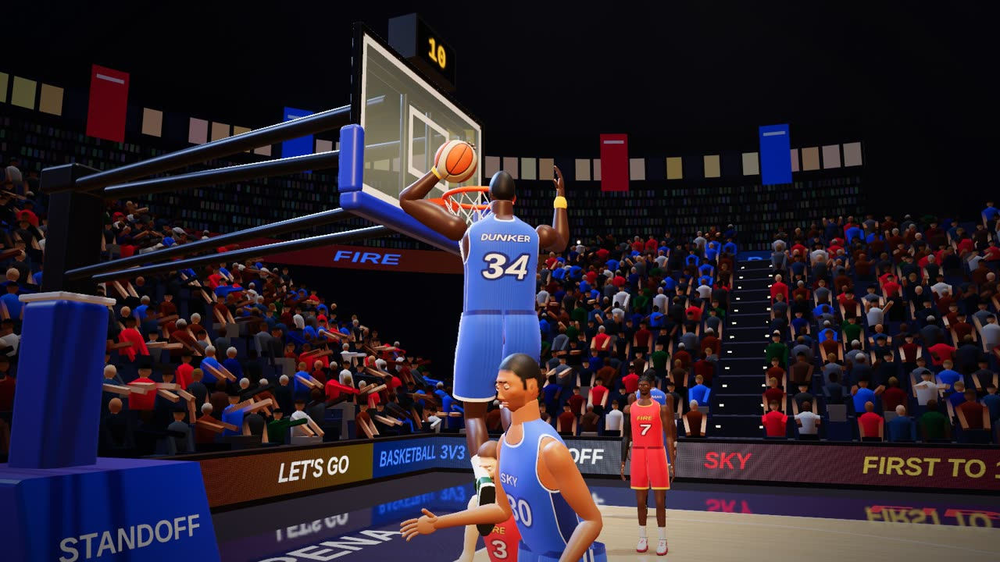
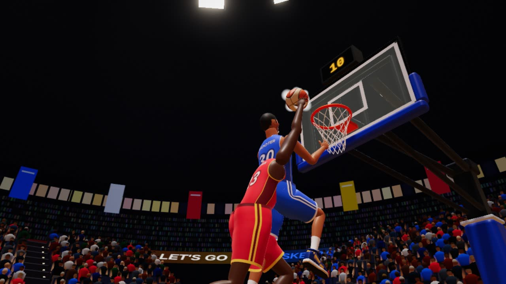
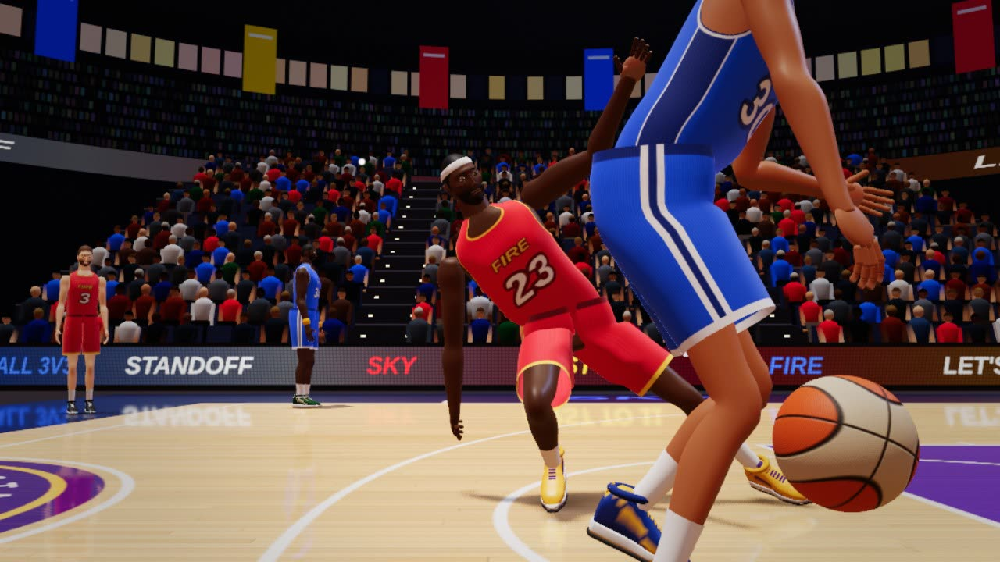

# Basketball 3v3

Status: ready. Half court basketball for 1 to 6 players: one on one, two on two or three on three, with computer players filling every empty spot. Turn them off to play uneven teams of people only. First to 11.

<table>
  <tr>
    <td width="33%" align="center"> A windmill dunk</td>
    <td width="33%" align="center"> A chase down block</td>
    <td width="33%" align="center"> Broken ankles</td>
  </tr>
</table>

## How to play

1. Open Basketball 3v3 on the computer. Everyone scans the code with their phone.
2. On the phone, after the name:
   * **Build.** Pick one of six builds, shown dribbling in 3D with your own name on the back, five stat bars and how it plays. A build another phone has is marked taken, so the six on the court always differ. See Builds below.
   * **Ready.** Tap Ready.
3. On the computer, the lobby shows two team columns, Sky and Fire, three spots each. New players land on the smaller team. Click a player to send them to the other side, or drag them across. Shuffle deals everyone out at random. **Game size** picks 1v1, 2v2 or 3v3, three by default. The columns hold that many a side and computer players fill the empty spots. When both teams are full the rest sit out, named under the teams; click one to bring them in, and the newest on that team sits out instead. Shuffle deals out up to the size and sits out the rest. Set Computer players to Off and the teams are just the people, so two friends can play one on one, and a team may have more players than the other. With them off, each team needs a player. Click Start game. On a short laptop screen the lobby tightens up, so Start game stays in view.
   * **Roles.** The host hands out the roles: Guard, Wing and Big. Each card shows its role; click a player's role to give them the next one, and a teammate who had it swaps. A new player takes the first free role. The role sets where a player lines up at the check and along the lane, and who they guard: a Guard picks up the other Guard.
   * **Computer difficulty.** Easy (the default), Medium, Hard or Training. Harder computers read the play sooner, run a touch faster and hit the green more often. In Training they stand still, so you can practise moves, shots and steals against them.
4. Turn the phone sideways. It is a controller:
   * **Thumb stick** (left half): always on screen, so it is clear how to move. Put your thumb anywhere on that side and it jumps there. It moves your player the way the big screen shows it. Up runs at the hoop. Players carry their weight (see Bodies below). The first steps are explosive and top speed comes over most of a second; they stop in a couple of strides, curve wide at full speed and plant a foot to cut. Heavy players get going a little later than light ones. With the ball a player is a little slower and turns wider, because the dribble has to come round too. With the ball you dribble on your own, keeping it away from your defender and crossing it over when they switch sides.
   * **Shoot** (big orange button): hold it and a meter fills, on the phone and over your player on the big screen. Let go in the green band to green it. Driving at the rim close in turns Shoot into a layup or a dunk. With space you always dunk, if your body can get up there. With a defender close by you lay it up round him. The finish follows the play: from under the rim, or cutting across it on the baseline, it is a reverse layup up the far side. A defender on the ball side gets a body shield layup. Running hard at the rim from the edge of the paint, or with a long defender waiting in the lane, it is a floater: up early off one foot on a soft, high arc. A jumper with a defender right in your chest starts with a stepback off him.
   * **Pass**: to the teammate most in the direction of the stick, or the most open one. Without the ball it becomes **Call**, which asks a teammate for it.
   * **Switching.** Pass to a computer teammate and you take him over as he catches it, like NBA 2K: your ring on the floor slides across to him and pulses, and his tag takes your colour. The computer plays the one you left. You never take another person's player. When you are the only person on your team, a computer teammate who steals the ball or grabs a rebound becomes yours the same way. Your name, jersey and box score stay with the player you picked.
   * **Block**: jump with your arms up, to contest a jumper or stop a layup or dunk, or to grab a rebound higher. There is a short crouch before you leave the floor, and a block counts most at the top of the jump, so time it.
   * **Dribble**: with the ball the same button makes a move, picked by the stick against the way to the basket. Pull straight back for a stepback, which makes room for a jumper. Pull back at an angle to go between the legs to that side, rocking back off the man. Push left or right for a quick crossover to that side. Push up for a spin round your defender. Leave the stick alone for a hesitation, or a behind the back when your defender sits on the ball hand. Press Shoot any time during a move and the jumper comes straight out of it. Moves beat a defender more often than not, and a beaten defender plays a reaction made for the move (see Dribble, shakes and blocks below). There is no banner for it; the reaction says it. Each move has a short breather after it, and spamming them, or making one into a defender right on top of you, can lose the ball.
   * **On defence** the buttons change. Shoot becomes **Guard**, Pass becomes **Block**, and the third button is **Steal** the whole time (see Defence below). Defence goes by possession, so the buttons do not flip while the other team passes.
   * The buttons never grey out during play, even while a teammate has the ball. Only free throws grey them. The shot meter only fills when you have the ball.
   * No score or shot clock on the phone: the big screen has them. The middle keeps your team, whose ball it is and anything you must act on. The buttons on the right take the room and size themselves to the space the phone has, with Shoot the biggest, low and out under the thumb.
5. The phone buzzes and flashes a word for everything that happens to you: Green!, Stolen, Blocked it!, Rebound!, +3. A juke only buzzes.
6. Baskets put no text on the big screen. The scoreboard ticks over and the arena answers.
7. First to 11 wins, with confetti and fireworks. Then the winning basket plays again in slow motion (see Replay below), and the winners lift the trophy at centre court (see The trophy ceremony). The results come up over the end of it: the winner, the MVP and both box scores, with points, rebounds, assists, steals, blocks and shots made. Each phone shows its own line. Play again keeps the teams; Change teams goes back to the lobby.

A ring on the floor in your phone's colour marks the player you move.

A phone that joins during a game picks a build and joins the next one. A player whose phone drops keeps their spot, with the computer playing for them until they are back.

## The rules

* Half court. Two points inside the arc, three outside it.
* After a basket or a turnover there is a check up. The scorer celebrates, a player from the other team picks the ball up and gets it to the checker, and everyone walks to their spot. At the top of the key the checker bounces it to their defender, who bounces it back, and play is live. The shot clock is stopped from the basket until then, and the stick and buttons do nothing. The scoreboard dims the clock and says Check ball; the phone says Check up. It takes about four seconds in all. A ball lost in the stands is thrown back in from courtside.
* After a defensive rebound or a steal, the ball must be taken back past the arc before it can score. The big screen and the phone say so.
* A 12 second shot clock with a horn. It resets when the ball hits the rim or changes hands. The clock also shows on the shot clock box above the backboard.
* The ball going out of bounds goes to the other team.

## Defence

* **Guard.** Hold it and your player shadows the man you guard on their own, between him and the rim, a metre off the ball handler and a little further off a man without the ball, sagging toward the ball. They run at four fifths of full speed, so the stick is still faster.
* The shadow reads the ball handler late. A dribble drags it, and a crossover, a spin or any other move leaves it well behind, so push the stick to catch up. Pushing the stick always takes over, and letting go hands back to Guard.
* Guard always follows your man. Further than five metres off, it sprints back to him. The phone shows a green light while Guard is shadowing him, and Catching up to your man on the way back.
* Guard locks on to one man and keeps him through passes and turnovers on the same play, until you let go.
* Guard can be held through the check up, and it takes your man as play goes live. A Shoot held on offence turns into Guard at once if the ball is turned over. Each new hold picks your man again.
* You guard the opponent in your own role. On an uneven floor it is the computer's matchup, or the nearest player.
* On the ball a defender sits in his stance with active hands: the hand on the ball's side low and out to swipe at it, the other up in the passing lane. When his man rises into a jumper he comes up out of the stance with a hand in the shooter's face, timed to the rise.
* **Block** (the Pass button on defence) jumps whenever you press it, Guard held or not. Guard pressed while you sprint to the post as the shot or the drive goes up is a two hand leap too. **Steal** is always there. Within reach it swipes at the ball; from further off it swipes at air, and the button is faded to say so.

## Fouls and free throws

* **Reach in.** A swipe from square in front of the ball handler plays the ball, and whatever it catches is clean. From the side or from behind, a swipe can catch the hand instead of the ball, and that is a foul. The first reach on a player in a possession catches the hand a little over a quarter of the time, and each one after that more often. The count starts again when the other team gets the ball, and after free throws.
* **On a shot.** A defender who goes straight up in front of the shooter at the top of the jump is clean. Jumping in late, from the side, or flying into the shooter is a foul more often, and so is being run over at the rim. A fouled shot is never blocked; it flies on and drops far less often.
* **Free throws.** Two for a reach in or a missed two, three for a missed three, and one when the fouled shot still goes in (an and one; the basket counts).
* **The call.** The whistle is a real referee's whistle: a short chirp and a long hard blast. Play stops, and a referee pops in beside the play in a striped shirt. He puts a fist up, then chops his wrist for the foul. On a shot he holds his arm up for the shots, and if the basket counts he swings his arm down twice. The big screen says FOUL, SHOOTING FOUL or AND ONE.
* **The line.** The camera drops in behind the shooter, looking at the rim over his shoulder. The fouled player walks to the line and the ball comes back to him. Everyone else lines up along the lane like a real free throw: the defence on the spots nearest the basket on both sides, the shooter's team on the next ones, the last defender above them.
* The shooter's phone shows only Shoot with a tall meter beside it, and which shot it is, like Free throw 1 of 2. Hold Shoot and let go in the green; the green band is a quarter wider at the line. Computer players shoot their own. A phone that waits eight seconds has its shot taken for it.
* Each free throw that goes in is worth one point. Every shot but the last comes back to the shooter. Play is live again as the last leaves the hand. On a miss the defenders step across and box out the attackers beside them, the attackers try to get round the inside, and the ball comes off the rim for anyone to jump for. A make on the last is checked up by the other team like any basket.
* Computer defenders reach in twice freely, a third time only now and then, and never a fourth.
* **Charge and block.** When the ball handler runs into a defender, the referee reads the contact the way the rule book does. A defender who got there first, set and square to the handler, outside the small arc under the rim, owns his spot, even giving ground straight back: running him over is a charge. The defender goes down on his backside with his hands behind him, a beat on the floor, and gets up again, while the handler lurches on over him. The ball goes to the other team and they check it up, and a teammate who is still on his feet fetches it. A defender who steps into the handler, or slides across late into his path, is blocking: a foul, and two shots. Anything gentler is play on, and the referee does not see every one. He puts his hands on his hips for a block and punches his fist into his palm for a charge, and the big screen says CHARGE or BLOCKING FOUL.
* **Test shortcuts.** While a game runs, the host's hidden admin panel (three quick taps on the settings gear) has Foul, Free throws, And one and Fouled three. They go to the first person in the game. Charge and Blocking foul happen to whoever has the ball, against the nearest defender. Next basket wins puts both teams one point short, so the next basket ends the game and rolls the replay. Win now ends the game on the spot with the tester's team on top, straight into the trophy ceremony.

## Replay

* After the winning basket the winners celebrate for a moment, then the basket plays again in slow motion, twice. First from over the scorer's shoulder, looking at the rim. Then from behind the defender who was on him, looking at the scorer as he rises.
* The replay shows the play as it happened, frame by frame, with the ball's own sounds: the dribble, the rim, the glass and the net. The arena's calls stay out of it.
* Any button skips it, but only when every player in the game has pressed one. The big screen shows a chip for each player that turns green once they have. The phone shows a big Skip button, then Waiting, and who else has agreed. A game with only computer players just plays it through.
* The vote follows who is there. A phone that drops during the replay stops holding it up, and one that comes back gets a say.
* Until the replay rolls, the phones keep the controller. The join code and the results wait until it is done, so nothing covers it.

## The trophy ceremony

After the replay the picture cuts to centre court. The winners stand together on the centre circle, facing the camera. The captain, their top scorer (a person before a computer player on a tie), holds a gold championship trophy from the victory kit at his chest: a ball dunked into a net on a slender column. The losers stand back down the floor by the key, hands on their knees.

* He looks down at the trophy, leans in to kiss it, dips at the knees and drives it up over his head with both hands. It stays in his hands the whole way, set between them every frame.
* As it goes up, cannons round the team fire confetti in the winners' colours, the spotlights flare, the organ horn sounds with a big brass chord, and the confetti keeps raining down.
* Until then his teammates clap him. Then they throw both fists up, walk in shoulder to shoulder with him and keep jumping, each in their own time. He pumps the trophy, roaring up at it, and turns it a little each way to show it round.
* The cameras: a close shot drifting round him at chest height, sinking low to follow the lift, a wide cut as it goes up, a crane that rises and swings across the front, then the kit's slow orbit. The arena's lights come down under the spotlights.
* The winners' own names drop in big across the top as the trophy goes up, top scorer first, with the score under them. A team of computer players only is named by its colour. The camera keeps the raised trophy under the names (`render/ceremony/ceremony-camera.test.ts`).
* About twelve seconds after the cut the box scores come up over it. Box scores in the corner brings them in early.

## Builds

A pick is a build, not a person. Your own name is who you are: on your tag, across the back of your jersey, on the phone, in the replay, on the trophy ceremony and in the box scores. Computer players are called CPU and their build, like CPU Shooter, and wear the build's name on their backs. All six live in `builds.ts`, so they are easy to edit. Ratings run 1 to 10, and each build adds up to about the same.

| Build | Speed | Shooting | Strength | Passing | Defence | How it plays |
| --- | --- | --- | --- | --- | --- | --- |
| Shooter | 8 | 10 | 4 | 7 | 5 | Deep range and the widest green on the meter. |
| Dunker | 9 | 4 | 10 | 5 | 6 | Explosive to the rim, dunks through contact. |
| Playmaker | 9 | 7 | 4 | 10 | 4 | Fast, accurate passes and slippery moves. |
| Lockdown | 8 | 5 | 7 | 5 | 10 | Quick hands, hard contests, sticky Guard. |
| Big Man | 5 | 4 | 10 | 6 | 9 | The longest arms for blocks and boards, a wall in the paint. |
| All Rounder | 7 | 7 | 7 | 7 | 7 | Good at everything, best at nothing. |

What each rating does in a game (`engine/build-effects.ts` for passing and defence):

* **Speed**: top speed, how quick a dribble move beats a defender, and how high a block goes.
* **Size**: small players are really faster. Each 10 cm under 2 m adds 5 percent to top speed, each 10 cm over takes it off, from 92 to 110 percent. Leg power gets the square of it and grip half of it, so guards also get going sooner and cut sharper. Top speeds: Playmaker 6.4 m/s, Shooter 6.1, Dunker and Lockdown 5.8, All Rounder 5.5, Big Man 4.6.
* **Shooting**: how wide the green band is, and how often the computer looks for its jumper.
* **Strength**: dunking through contact, knocking smaller defenders over, holding a spot, and the block at the rim.
* **Passing**: how fast a pass flies and how well it leads a runner, how hard it is to pick off, and a tighter handle against steals. Computer playmakers look for the pass more.
* **Defence**: the chance a steal comes off, how hard a hand in the face contests a shot, how well a defender reads a dribble move, how fast Guard keeps up, and picking off passes.
* **Body**: height and arm length set reach for blocks, rebounds and contests; weight sets how quick a player gets going.

Each build has a signature dunk: the Shooter's scoop, the Dunker's windmill, the Playmaker's one hand flush, the Lockdown tomahawk, the Big Man's two hand hammer and the All Rounder's reverse. It is always in the mix, but the play picks the dunk (see Layups and dunks).

## Celebrations

* After an ordinary basket the scorer does his own quick celebration.
* After a big basket he does a small gesture once his feet are down. A dunk or an and one over a defender gets the too small pat: a hand held out low, patting the air as if on a child's head. A deep or contested three gets the sleep sign or the shush. For the sleep sign the left hand crosses over, both palms press together under the right cheek, and the head lies on them. For the shush the index finger comes up to the lips, elbow down in front, with the other arm out.

## Shooting

* The meter fills in 0.82 seconds. The green band sits near the top; its width grows with the shooting stat (the Shooter's is widest) and by half again for a player on fire. Half the green is 40 ms plus 4.4 ms per shooting point, so 62 ms each side for a 5 and 84 ms for the Shooter.
* **Gold.** A thin gold line sits in the middle of the green, a fifth of its width and never under 11 ms each side. A gold release is a sure swish: no hand gets to it, even guarded, it never goes off the glass, and a foul on it still lets it drop. The phone flashes Gold! on a gold background with its own buzz, the meter over the shooter on the big screen flares gold, the glass edge lights gold, gold sparks burst off the hands and trail the ball down through the net, and a bell arpeggio plays. Computer players hit gold about one jumper in sixteen and green about one in three.
* The chance to score comes from the release (green, good, early or late), the distance, the shooting stat, and the nearest defender's contest. A defender in front contests a little; one who jumped with Block contests fully and may block the shot, more likely with long arms. A three leans on the green more than a two: a good release from beyond the arc keeps under three quarters of the chance it would have inside, so computer games shoot about 40 percent from three, as in NBA 2K.
* Green releases go in almost every time unless heavily contested; only gold beats a hand in the face. The phone measures how long Shoot was held, so network lag never costs a green.
* **Shot endings.** How a shot ends is picked the moment it leaves the hand, the way a sports game picks an animation, then flown for real (`engine/shot-outcome/`). There are eleven endings: a swish, off the glass and in, in off the front rim, in off the back rim, a rattle in, a toilet bowl roll round the ring and in, a rim out, a clang off the back iron for a long rebound, a toilet bowl that rolls round and out, off the glass and out, and an airball.
* The picker (`pick.ts`) first decides make or miss from the chance, then the ending from the same things that set the chance. A clean green jumper is mostly a swish. A poor release that still drops finds the iron. An early release catches the front rim and a late one goes long off the back iron. Close layups and floaters roll round the ring far more than jumpers. From the wings the glass comes into play, and straight on it never does. Airballs are rare: a hand in the face, a deep heave or a wild release.
* The solver (`solve.ts`) throws the ending from a hand made aim (`recipes.ts`): a soft high arc a touch short to kiss the front iron, a ball past the middle onto the back of the ring, a ball landing on top of the ring to roll round it. Each try is flown ahead through the same physics, frame by frame like the live ball, until one ends exactly that way. Most land in the first few tries, a shot costs about a third of a millisecond in the middle and never more than a few. If no try gets that exact ending, the nearest one that still goes in or still misses is used.
* The toilet bowl is the one authored path (`rim-ride.ts`). From the touch the ball hops softly off the iron, rides the top of the tube slowing as it goes, wobbles, then tips over the inside or the outside and is handed back to the physics on the tube with the speed it had. The drop through the net or off the iron after that is real.
* Everything else is physics from the hand: the glass, the iron and the net decide each bounce, the net reacts as the ball goes through, and a miss or a block flies off for the rebound under the physics alone. Over a game shots drop as often as the shot model says.
* The bank spot on the square is found by Newton steps from the shooter's angle (`engine/physics/bank.ts`).
* Jumpers leave the hand with two and a half turns a second of backspin. Layups are rolled softly off the fingers. A floater goes up early, high and soft with little spin, and beats a contest better than a jumper does (`engine/floater.ts`).
* A defender in the air blocks a shot only where his arm really reaches, from the shoulder up, and he gets one chance at it as it passes. The timing of his jump, the length of his arms and his defence decide whether he gets a hand on it. It is all decided before the hand gets there (see Dribble, shakes and blocks below), and after the touch the ball flies off on the physics alone. Nobody touches a ball coming down above the ring.
* A dunk is driven down through the ring by the hand. Contact can put it off line, and then it comes off the iron.
* The showcase films set the ending through the same solver.

## How the finishes play out

Measured over 30 computer games a level, with the ball physics deciding every shot:

* Layups go in about 46 percent of the time against Easy bots: nine in ten when nobody is close, under one in three with a defender on the shooter. Hard bots defend better and hold them to about 39 percent. That sits a little under a real paint, so it is left as it is.
* Over 14 computer games there were about 55 layups and 40 dunks. Reverses are still the most common layup, because the computer often gets the ball back under the rim off a rebound. Then come power layups, wrong foot layups, finger rolls, scoops and the glass.
* An engine step takes about three hundredths of a millisecond on average. The slowest real one is a jumper being aimed, about three milliseconds. Longer stalls in a browser are garbage collection and a busy machine, not the game.

## Ball physics

* The ball is a real size 7 ball: 24 cm across, 620 g, a thin rubber shell (`engine/physics/ball-spec.ts`). Every number is measured, or worked out from a measurement.
* It moves in fixed steps, 480 a second, eight in every frame (`engine/physics/world.ts`). A path is the same every time it is flown, and a fast ball can never slip through the thin iron.
* In the air it has gravity, drag from its size and weight (a long heave loses a metre or two of carry) and Magnus lift from its spin. Backspin floats a jumper a touch and side spin bends a ball. The air slowly takes the spin.
* Every contact with the floor, the iron or the glass is a push along the surface that keeps part of the speed coming in, and friction that trades sliding for spin up to the grip (`engine/physics/contact.ts`). That is why backspin drops a ball off the back iron while topspin kicks it up, why a ball rolls round the ring and falls in or out, why a bank kisses off the glass and down, and why a loose ball skids before it rolls.
* Dropped from 1.8 metres the ball comes back to between 1.2 and 1.4 metres measured to its top, as FIBA asks, and a harder bounce keeps a little less. On the floor a backspun ball checks up and a ball with topspin skips on. Slow enough, it rolls, its weight pressing it into the maple so friction works until it rolls clean, and rolling resistance slows it.
* The rim is a torus, a steel tube bent round the ring, so the ball meets it wherever it really would: on top, on the inside or on the front edge. A bracket holds it to the glass, and the ball can hit that too. The rim gives on a hard clank, like a spring loaded ring. The glass sits in a frame with padding along the bottom, which takes the life out of a ball that hits it.
* The net hangs as a cone that narrows to just wider than the ball (`engine/physics/net-drag.ts`). Going through, the ball brushes the cords, which take its speed and spin. Off centre it rides the cone and is squeezed back to the middle, and a ball falling just outside brushes it too.
* A basket is the ball's centre going down through the ring: past that point it cannot come back up. A ball that rolls round and drops in late still counts.
* Passes are real throws. The passer aims at the receiver's chest where he will be, the hands put it a little off (less for a good passer, more with a defender on him), and it flies with the backspin of a chest pass. It is caught when it reaches the receiver's hands. A defender it passes close to may pick it off, or only get a finger on it and knock it loose. A pass nobody reaches is a loose ball.
* The dribble is on the same physics (`engine/dribble-ball.ts`, `engine/dribble-path.ts`). The hand takes the ball as it rises, rides it and pushes it down with the speed and the roll that bring it back to where the hand will be. Between, the ball is on its own and bounces off the floor like any ball, the roll from the fingers carrying the run through the bounce. Where the hand works it comes from the blended dribble presets (`engine/dribble-style.ts`). A crossover sends it across in front, a behind the back goes round the hips, between the legs bounces it under the hips, and a hesitation is high and slow. If a player is shoved or cuts hard while the ball is down, it can get away from him.
* The bounce passes of the check up, a ball thrown back from courtside and the two bounces at the free throw line are real throws on the same physics.
* Aiming a throw flies the plain arc through the air, sees where drag and spin really take it, and corrects the aim a few times over, the way a player's touch learns how the ball carries (`engine/physics/aim.ts`). It takes about a millisecond.
* Computer players weigh every jumper by the points it is worth on average: their own meter timing, the distance and the defence. Shooters look for their shot, drivers like the Dunker attack open lanes, and the ball goes to whoever is most dangerous.
* Three makes in a row: heating up. Four: on fire, with a flaming ball, a wider green and a little more speed, until you miss or the other team scores.

## Bodies

* Every push, brake and turn goes through the shoes, and sneakers on maple grip at about one g. Together they can never pass that grip. A player braking hard cannot turn at the same moment, and at full speed the tightest curve is a few metres wide: speed squared over the grip. A turn sharper than that plants the outside foot, which digs in a little harder, bleeds speed and comes round with a squeak.
* Speeding up is limited by grip from a standstill and by leg power once moving, since force is power over speed. So the first steps are explosive and the last of the speed comes slowly. Legs give about 20 to 25 watts a kilogram, more for quick builds, less for heavy ones, and a little less with the ball.
* Each build has a real weight from its frame, from about 76 kg for the Playmaker to 121 kg for the Big Man (`engine/body/mass.ts`).
* Players who run into each other trade momentum by weight. A set player braces with his legs and counts as heavier, more so with strong legs; one on the run or in the air counts only his weight. A guard who sprints into a big man's screen stops dead and the big man barely gives. Players brushing past each other rub off some sideways speed, and a hard hit leaves the one it rocked with slow legs for a moment.
* Jumps follow real gravity. The height of a jump sets how long it lasts: a block jump of half a metre is about 0.64 seconds off the floor, and every jump falls at one g. A dunk or a layup leaves the floor at the speed that has the hand at the rim exactly when the ball goes. A showier dunk that needs longer goes a touch higher and slams on the way down. A dunker hanging on the rim drops a hand's length under his hands, then falls from rest. Along the floor the last two steps of the gather slow the run, and in the air the body carries straight on at a steady speed.

## How the ball and the net look

* The ball has twelve two tone panels, orange and cream with dark channels, worked out on the sphere itself (`render/ball-skin.ts`): two great circles cross, and four ovals sit round the sides and the poles. The orange leather is pebbled with small domes a few millimetres apart, deep on the orange and light on the cream, and the channels are sunk into the same bump map, so the arena lights catch the grain and the seams. There is no printing on it. It turns with the spin the physics gives it, so the backspin on a jumper, the kick off the iron and the roll on the floor all show. On a hard bounce it flattens against what it hit for an instant, about seven percent, and rings back (`ball-squash.ts`).
* The net is cloth (`render/arena/net-sim.ts`): knots and cords in the diamond mesh of a twelve loop net, hanging from the hooks under the ring and tapering below the ball's width. The ball pushes the cords out of its way and drags the ones it rubs, so a swish pulls the net down and snaps it out. Every cord is drawn as a thin tube.
* The ball rolls off the fingers on a jumper and a free throw (`render/release-roll.ts`). The engine lets go in one step while the drawn arm takes a few frames to snap through, so for the first tenth of a second the drawn ball is blended from the shooting palm onto its real flight. Only the picture changes.
* The ring is hinged at the bracket on a spring (`rim-spring.ts`). A hit on the iron dips it, more at the front, and it rings for a moment. A dunker hanging on it bends it down until he lets go.

## How the players look

* Every player is one smooth skinned body on a skeleton of nineteen bones (`render/models/`), built from the build's height, shoulder width, bulk and reach. Arms and legs are shaped muscle by muscle: the cap of the deltoid, biceps in front and triceps behind, the forearm swelling under the elbow and flattening to the wrist, the quads, the teardrop over the knee, the kneecap and the two heads of the calf. The chest widens to the lats and swells into the pecs, then slopes over the trapezius into a real neck. Each limb bends smoothly across its joints, weighted between the bones on either side.
* The head is sculpted from a sphere (`head-shape.ts`): a fuller crown, a jaw that narrows to the chin, a brow that shades the eyes, cheekbones and the angle of the jaw. Ears, a lofted nose, lips, eyes with dark irises, lids and brows are set into it (`face.ts`). Hair and beards are shells lifted off the same surface, so they always fit (`hair.ts`): a buzz, a short cut that fades from the top, waves round the crown, a curly top, a swept cut with comb lines, or twists. The hairline and the edge of a beard are painted soft on the skin. A headband is lofted round the head over the hair.
* Hands have a palm, the pad of the thumb, four jointed fingers in a relaxed curl and a thumb, lighter on the palm side, with nails (`hands.ts`).
* The shoes are high tops (`shoes.ts`): a rubber outsole, a white midsole thicker under the heel with an accent line, a glossy upper with a darker toe and heel, an accent panel sweeping down each side, laces, a tongue, a padded collar and a pull tab. Crew socks have a ribbed top. Builds wear their own compression sleeve, wristbands or headband.
* The kit is one print per player (`kit-texture.ts`): the team name and number on the front, the player's name and number on the back, dark side panels, and piping round the armholes and the neck, which are cut out of the cloth. The jersey is cut from the torso's shape a little looser and hangs straight from the chest. The shorts are two legs shaped like a D, flat where they meet, so above the crotch they read as one garment with a seam and below it the legs part (`shorts.ts`). The referee wears a striped shirt with short sleeves and long dark trousers.
* Skin lets light wrap past the shadow line, red furthest, the way light scatters under real skin, and its shine varies over the body (`materials/shader-patches.ts`). The kit is cloth with a soft sheen and a mesh knit. Close up, skin shows pores and hair shows strands or coils, drawn in the shader as fine bumps that fade out as players get small on screen (`materials/micro-detail.ts`).
* Everything one material draws merges into one skinned mesh, so a player costs three draws: skin, kit and gear. Each build's geometry is built once and shared (`athlete-geometry.ts`). A player is about 31 thousand triangles at full detail and 15 thousand at low detail. `?lab=lineup` in the showcase stands all six builds in a row for a close look.

## How the players move

* Walking, jogging and sprinting are one gait that changes with speed (`render/anim/gait.ts`). While a foot is down it slides back under the hip exactly as fast as the body moves on, so it stays planted. In the swing the knee folds, up to the seat in a sprint, and the thigh drives through. Between running steps both feet leave the floor. The arms swing against the legs, the pelvis turns with the leading leg, the shoulders turn against it and the head stays square. Stepping sideways the legs open and close instead.
* The dribbling hand really meets the ball (`dribble-hand.ts`, `arm-ik.ts`). An arm reach turns the shoulder and bends the elbow to put the palm on top of the ball the physics moves, riding it down on the push and rising to wait where it will come back up. The phone's build picker uses the same reach. Attacking the rim the dribble goes lower and tighter to the hip, and the body sinks with the shoulders over the ball and the eyes up. Under pressure the off arm bars across the chest.
* The shorts' legs swing after the thighs on springs, and the chest breathes, slow at rest and deep after a sprint (`anim/cloth.ts`). A hard bump jolts both players, the chest snapping with the push and the head whipping after it (`anim/flinch.ts`). A rocked defender lunges the wrong way, and a player who takes a charge or is run over sits down on the court and gets up again (`anim/reactions.ts`).
* Bursts, stops and cuts lean the body and plant a foot, a landing gives at the knees, and every action plays on the engine's own clock with its follow through (`anim/action-pose.ts`). A floater goes up off one foot with the other knee driving, the ball carried up in front and let go early at full stretch (`anim/floater-pose.ts`). The defender on a shooter comes up out of his stance with a hand in the shooter's face, and a player with a pass coming reaches both hands out to the ball.

## Layups and dunks

Every finish at the rim is a hand made preset (`engine/finish/`): its own footwork, timing, height, ball path through the hands and release. The game picks it before the gather starts, then plays it out. The physics only takes over once the ball leaves the hand, or once the dunk drives it down through the ring.

* **When.** Shoot while driving at the rim with some speed, close in, or under the glass. Running hard from the edge of the paint, or at a long defender waiting in the lane, it is a floater instead.
* **What it reads** (`approach.ts`). The angle (straight down the lane, in from the wing, or along the baseline), the speed, the natural hand (the side of the rim the drive is on), and the defender that matters most: in the path, waiting at the rim, beside on the ball side or the other side, or chasing from behind. Also whether he is already in the air, and who is stronger.
* **Space means a dunk** (`select.ts`). Nobody within 1.8 m and nobody waiting at the rim, and anyone who can get the ball over the ring dunks. Walking into it, a two hand dunk off a jump stop. Settled, mostly the two hand flush. With speed, a tomahawk or a cock back. Along the baseline, a reverse or a windmill. A much stronger man goes up through a smaller one in his way: the poster, and the man under it is knocked down.
* **A defender close by means a layup that beats him.** In the path at speed, a euro step or a spin. In the path up close, an up and under, a spin or a body shield. On the ball side, a body shield. From the other side, a scoop or the glass. Chasing from behind, off the wrong foot early. A big man at the rim, a teardrop from out, the glass from the wing, or under him once he leaves his feet. Nobody near, a finger roll from the front or the glass from the wing.
* **Layups** (`layups.ts`): finger roll, reverse, euro step, up and under, scoop, teardrop, high off the glass, wrong foot, spin, body shield and power. Each has its own steps: the plain two step, the euro step across, a stop with a pump fake (a computer defender close by usually jumps at it), a full spin, a jump stop, or one early step.
* **Dunks** (`dunks.ts`): two hand, one hand flush, tomahawk, cock back, two hand hammer, windmill, reverse, three sixty, scoop, double clutch, rim hang, poster, putback, alley oop and the jump stop dunk. An open cutter running hard at the rim gets the lob, catches it and goes straight up into the alley oop (`alley.ts`).
* **The ball stays in the hands** (`ball-track.ts`, `render/finish-hands.ts`). From the pick up off the last bounce to the release, the ball follows the preset's path through the hands and the hands are put on the engine's real ball. A dunk takes it over the ring in the hand, slams it down through the net, and the hands go on the ring for a slap or a hang. No ball floats to the rim on its own.
* **Hard to block.** A layup made to go round the man takes much of the sting out of his contest and much of his chance to get a hand on it: a reverse uses the rim, a scoop and an up and under go round the hands, a body shield keeps the ball the far side of him. They draw fewer fouls too.
* **Release.** A layup leaves the hand clear of the ring, even from right under it, so it can go up and drop. It then gets an ending from the shot picker like any shot.
* Each dunk has an approach, the last two steps, a deep load onto both feet with the ball swung down, the rise with the arms driving up, time in the air, the slam, and either a hang on the rim or letting go straight away, then the landing. On a hang the body drops a hand's length as the arms take the weight, the legs swing under and settle, then he lets go. Players land with slow legs for a moment.
* The plain layup gather is two steps: the ball comes up off the last bounce into both hands at the hip and is carried tight at the chest, the right foot plants, the left plants long with the knee loaded, and the right knee drives up. Off the fingers the ball is rolled up at full stretch. A reverse is carried under the rim with the back to the basket, the head turned up over the shoulder, and flipped up the far side. A body shield layup dips a shoulder into the defender, braces the off arm against him and lays it up high and away in the far hand. Contact at the rim is a foul more often.
* A big dunk shakes the rim and the camera, slows time for a moment and the camera swoops in.
* **Lab scenes.** `/showcase/nba-3v3?lab=layup-euro&step=1` or `?lab=dunk-twoHand&step=1`, one for every layup and every dunk.

## Dribble, shakes and blocks

The dribble, the shake and the block are hand made presets too, picked by the game as the move starts. The physics still moves the ball between the hand and the floor, and after a block.

* **Dribble presets** (`engine/dribble-style.ts`). Pound standing still, jog, sprint, drive, retreat and protect. Each sets where the palm works the ball (how high, how far ahead, how far out) and how quick the pound is. The live dribble is a blend of them by speed, the way the body travels and how close the nearest defender is, eased over about a tenth of a second. Sprint and the ball goes low and tight at once, lower still at the rim. Back up and it is low at the side. A defender in your chest and it goes low on the far hip with the body between. The hand always meets the ball: the engine puts the ball where the palm will be, and the arm reach puts the palm on it.
* **Moves** (`engine/moves.ts`, `engine/move-pick.ts`): stepback, crossover, between the legs, behind the back, hesitation and spin, each with its own footwork (`render/anim/moves.ts`).
* **Shakes** (`engine/shake.ts`, `render/anim/shake-poses.ts`). A move that beats a guarding defender plays a reaction made for it. A stepback or between the legs makes him bite: he lunges in at the fake. A hesitation freezes him: stood up flat footed, then a late push off. A crossover or a behind the back makes him slip the wrong way, and a hard one takes his ankles: down on one hip with a hand on the floor. A hard shake is one beat in four, more on a man who reached or bit already, so broken ankles stay a highlight, about one shake in seven. A spin turns him round. While he recovers he barely contests a shot, so the shake buys the space.
* **Flow.** Shoot pressed early in a move waits for it and comes straight out of it into the jumper, already partway through the dip. Keep going instead and the move carries on into the drive.
* **Block jumps** (`engine/blocks/style.ts`, `render/anim/block-poses.ts`). How a defender goes up is picked as he leaves the floor: standing square with both hands, a running two hand leap that carries him on, the chase down from behind with one long arm, or the weak side help leap when a teammate is already on the man.
* **The block plan** (`engine/blocks/plan.ts`). As soon as he is up and a shot is in the air, the shot's real flight is flown ahead next to his jump to find the moment the ball comes into his reach. The block math is rolled for that moment, so the touch, or the near miss, is known before the hand gets there, and `render/block-reach.ts` times the strike to arrive on that spot at that moment.
* **Block hits** (`engine/blocks/hit.ts`). A swat through the ball back toward the floor, a volleyball spike over the top and down out of bounds, the ball pinned flat to the glass on a chase down or a layup, or only a fingertip when the path just grazes his reach. A strong man spikes more often. The ball then flies off on real physics.
* **Near misses.** A ball that passes close but out of reach still draws a full stretch at it, and the hand falls just short and drops away.
* **Bots** chase down a driver from behind when they trail him to the rim.
* **Lab scenes.** `?lab=move-crossover` (and `move-stepback`, `move-betweenLegs`, `move-hesitation`, `move-behindBack`, `move-spin`, `shake-ankles` and `dribble`) and `?lab=block-chase` (and `block-stand`, `block-run`, `block-help`, `block-layup`, `block-spike`, `block-pin`, `block-tip`, `block-miss`).

## Strength and the stepback

* A stepback jumper is a real hop: off the front foot, a few centimetres off the floor for a fifth of a second and most of a metre back from the defender. Both feet plant wide together and take the speed out of it, the dip loads, and he rises straight up on balance (`engine/stepback.ts`).
* Driving into a weaker defender (two or more strength points less) sends them sprawling. A defender in the way turns a dunk into a layup unless the driver is much stronger. Strength also decides who gets pushed off a spot.

## How the arena looks

* The floor is lacquered maple (`render/arena/floor.ts`, `maple.ts`, `floor-texture.ts`). A tiling detail map gives each board its own shade and grain, and the joints are sunk into the normal map. The lines, the key and the logos are paint over it, stained thin enough in the key and on the apron for the boards to show through. The centre circle carries the game's logo and the sidelines carry the team names (`floor-logo.ts`).
* The floor is a mirror under the gloss. A half size reflection of the players, the ball, the basket and the LED boards is drawn each frame, blurred and blended in by angle, so it is faint looking down and strong across the floor (`floor-mirror.ts`).
* Soft dark pools sit under every sole, the referee and the ball, fading as they leave the floor, so nobody floats (`render/contact-shadows.ts`). They are one instanced draw.
* The basket stands on a padded base with a sloped front and the name on it, a padded post and twin steel arms (`stanchion.ts`). The backboard is nearly clear glass with a lit frame and padding along its bottom edge, and it catches the roof lamps (`backboard.ts`). Pieces with the same finish are baked into one mesh (`bake.ts`).
* The stands have rows of seats, aisles with step lights and a pale nosing on every step (`stands.ts`, `seat-layout.ts`). Fans sit in the seats with shoulders, hair and two colours each, and stand with their arms up on big plays. Phones flash round the bowl (`crowd-flashes.ts`). The whole crowd is three draws. There is still no crowd sound.
* LED ribbons run round the bowl and a scoreboard hangs over centre court with the live score (`led-boards.ts`, `jumbotron.ts`). Both show their picture through a grid of diodes that fades with distance, bright enough to glow.
* Lamp banks hang on truss rings in the roof with faint beams of haze under them (`roof.ts`). The environment map is a stand in for this arena, its lamps, ribbons, scoreboard and the warm bounce off the floor, so the ball, the rim, the glass and the floor reflect the room they are in (`arena-environment.ts`).

## Light, the picture and the camera

* The light is physically based (`arena/lighting.ts`). The key is the lamp bank over the court, high and nearly overhead, so each player's shadow pools soft round his feet and the ball's follows it down. A weak sky and floor pair fills under the environment map, and a cool rim from behind the basket lifts the players off the stands.
* The scene draws in linear light into a multisampled half float picture (`render/post/`). It then gets a soft bloom on the lamps, the LEDs and the highlights, the ACES filmic curve, a TV grade and a light vignette. Replays and the trophy ceremony ease into their own grade with depth of field, and only there (`post/look.ts`).
* The broadcast camera leads the play (`tv-camera.ts`, `broadcast-framing.ts`). It aims where the play is going, eases into and out of each pan on springs, and its lens tightens a few degrees when the players bunch up and opens when they spread.
* Measured in Chromium at 1920 by 1080 on the full finish: about 128 draws and a million triangles a frame, counting the shadow pass and the floor's mirror, and about 50 MB of scene textures.

## Sound

Everything is synthesised through the room's audio buses. Effects have a sharp hit, a body and a tail into a synthetic arena reverb, and each one is pitched slightly differently every time: sneaker squeaks, passes, blocks, the shot clock beeps, its horn and the final buzzer.

The ball's own sounds (`audio/ball-sounds.ts`) are built from what really rings, as a few decaying sine tones each with only a breath of filtered noise for the contact, so nothing hisses. They follow the physics: every bounce, touch of the iron and hit of the glass sounds as hard as it was.

* **The dribble on the hardwood**: the slap of rubber on maple, the low thump of the floor giving, and the ping of the air inside the ball at about 950 Hz with its overtones. A hard bounce is louder and brighter; a low pound is mostly thump.
* **The rim**: a steel ring rings in its bending modes, at 1, 2.83, 5.42 and 8.77 times the lowest. A soft touch is a dull tick of the lowest mode; a hard hit wakes the high modes and rings on much longer. Each mode is split in two by the bracket, so a hard clank beats as it dies, and where the ball strikes changes which modes speak.
* **The glass**: a boom of the heavy board and the stanchion, a short knock of the ball on the face, and a faint ring of the frame after a hard one.
* **The net**: the ball brushing the cords all the way down, falling in pitch as it slows, then the snap back. A clean swish is long and airy; a ball that rattled in is shorter. The referee's whistle (`audio/whistle.ts`) is three chambers tuned a little apart, beating against each other like a real pealess whistle, with the breath bending each blast up to pitch.

Music: two songs, each sixteen bars with an A and a B section, written as text a bar a row and played through a warm low pass (`audio/music.ts`, `audio/score.ts`).

* "Night Court" plays in the lobby and on the results. A slow late night soul tune in D flat major at 82. A soft choir pad swells under every bar and hands each chord to the next, a mellow sax sings the A section and a Wurlitzer with a lazy tremolo answers in the B section, over a round bass, a padded kick, a side stick and a shaker.
* "Full Court Press" plays under the game. Bouncy arena hip hop in B minor at 96. Brass stabs shout the hook through the A section, then a bell answers up high in the B section while the brass hits the chords. A sliding 808, a tight kick, snare and clap on two and four, and hats that roll into each turn. Its hook is short and its held sounds sit low, so the organ stabs and the stomp stomp clap sit on top, and it steps back while the beat plays.
* The music ducks under dunks, threes and the winners' brass fanfare.

There is no crowd noise and no spoken commentary. The arena carries the moments instead, all synthesised on the effects bus. Every dead ball and every foul gets the stomp stomp clap beat: a punchy kick twice, then a sharp clap, for a few bars until play is live, with the music stepping back under it. The shot clock beeps through its last five seconds and buzzes at zero. The game horn sounds at the tip and at the final basket. The organ stabs on dunks, threes and blocks, and plays the charge call for a hot hand and at game point. On screen, banners are kept for the tip, blocks, steals, turnovers, game point and the win.

## Code

* `builds.ts`: the six builds. `roster.ts`: the ratings, bodies and looks they are made of, and the two teams.
* `engine/`: the game as pure code. The court, the shot model and meter, the ball physics in `physics/` (the ball and the air, the surfaces, the net, aiming, the bank spot, the bounce solver, and the watcher that names how a shot went), shots thrown on it (`shot-launch.ts`, `shot-release.ts`, the release error in `shot-error.ts` and `shot-calibration.ts`, the endings picked and solved in `shot-outcome/`), the ball in the hands and in the air (`ball.ts`, `ball-flight.ts`, and the hands on it in `ball-touch.ts`), floaters (`floater.ts`), the finishes at the rim (`finish.ts`), the stepback jumper (`stepback.ts`), the celebrations (`celebrate.ts`), the trophy ceremony (`ceremony.ts`: its timing, the captain and where everyone stands), what passing and defence do (`build-effects.ts`), the tape the replay is cut from (`replay-tape.ts`), the rules, the check up (`check-up.ts`, `check-plan.ts`, `check-toss.ts`), running on grip and leg power (`steer.ts`), weights, body contact, jumps under gravity and the referee's read of a charge or a block (`body/`), the dribble and crossovers, the dribble on the ball physics (`dribble-ball.ts` and `dribble-path.ts`: the hand and the bounce, one bounce every two steps on the run, a low pound standing still, the pocket after a catch), the dribble presets (`dribble-style.ts`), the dribble moves (`moves.ts`, `move-pick.ts`, the chance to beat a man in `juke.ts`, the reaction in `shake.ts`, and the shot out of a move in `move-flow.ts`), passing, steals (`steal.ts`), Guard (`guard.ts`), the foul rules (`fouls.ts`, `shooting-foul.ts`), the whistle and the referee's call (`foul-call.ts`), free throws (`free-throw.ts`, `free-throw-ball.ts`, `free-throw-plan.ts`), the block jump (`block.ts`) and the block presets, their plan and their hits (`blocks/`), dunks and layups (`drive.ts`, and the presets, their selection and the ball in the hands in `finish/`), and the computer players in `bot/`, with the lobby's difficulty in `bot/skill.ts` and the box out on the last free throw in `bot/scramble.ts`. Unit tested, including whole computer games played to 11.
* `render/`: three.js. `arena/` has the floor and its mirror, the stands with an instanced crowd that moves in the shader, the LED boards, the scoreboard, the roof, the stanchion and the glass, the lights, the hoop with its shot clock box, a ring on a sprung hinge (`rim-spring.ts`) and a cloth net (`net-sim.ts`, drawn in `net.ts`). The ball's two tone leather is `ball-skin.ts` and its squash `ball-squash.ts`. `models/` builds each athlete and `materials/` shades them (see How the players look); `anim/` poses them (the gait, dribbling with either hand, guarding, shooting, passes, catches, the check, blocks, steals, the gather, the layups and the dunks in `finish/` with the hands on the ball and the ring in `render/finish-hands.ts`, the stepback, the celebrations, and the gestures after big baskets in `gestures.ts`). Every change of state eases into the next. The stride follows the ground covered. On the floor each ankle takes up the tilt of its shin so the sole lies flat, and the hips settle so the lowest sole stands on the court, so no toe sinks into it and the feet stay planted (`placement.ts`). A turn the engine makes at once, squaring up for a pass, a steal or a drive, is eased over a few frames. The drawn dribble runs from the palm to the floor and back up under the palm, in step with the feet, and the ball stays in the hands through the pocket, a spin, a shot and a dunk. Bursts, stops and cuts lean the body and plant a foot (`balance.ts`), the dribble moves have their own footwork (`moves.ts`), a beaten defender his reaction (`shake-poses.ts`), each block jump its own clip (`block-poses.ts`), and the free throw routine has its bounces, a set shot and the lane stances (`line.ts`). `effects/` has the particles and the confetti. `post/` is the broadcast finish and `picture.ts` decides whether a frame goes through it. `ceremony/` is the trophy ceremony: the kit's trophy in the captain's hands (`trophy-grip.ts`), the spotlights and confetti (`ceremony-scene.ts`), its cameras (`ceremony-camera.ts`), and who plays which part (`ceremony-stage.ts`); the lift and the teammates are posed in `anim/trophy-poses.ts`. `tv-camera.ts` is the broadcast camera, and `free-throw-camera.ts` says when it goes behind the free throw shooter. `referee.ts` and `referee-model.ts` are the referee and his signals. The name tags stack when players bunch up, so none covers another (`tag-layout.ts`).
* `host/`: the session on the computer (lobby, teams and roles in `roles.ts`, the admin shortcuts in `admin.ts`, the match driver, the replay in `replay-director.ts`, `replay.ts` and `replay-camera.ts`, the names over the ceremony in `ceremony-card.ts` and `components/Champions.tsx`, what the phones see, where each game event goes in `event-fanout.ts`, the banners in `callouts.ts`, and the buzzes) and its React screens.
* `phone/`: the controller session and the phone screens. The stick and buttons use the gamepad kit in `src/games/kit/pad`.
* `keyboard/`: keyboard play for testing on one computer (see Keyboard below).
* Switching control: `host/control-switch.ts` decides who a phone takes over after a pass, a steal or a rebound, `engine/hand-over.ts` swaps the computer and the phone between the two players, and `render/control-rings.ts` draws the rings on the floor. The gold release effect is `render/effects/gold-release.ts`.
* `audio/`: effects, the arena's beat, horns and organ, and the music.
* `protocol/`: the zod schemas for the messages between the phones and the host.
* `showcase/`: the home screen trailer and stills. The trailer cuts between copies of two films: the scripted highlight (the Dunker's crossover and windmill dunk, then the Playmaker's iso and stepback three) and the trophy ceremony. `?t=4` holds the trailer four seconds in. For looking at the animation in development, `/showcase/nba-3v3?bots=3` films a whole computer game instead, and `&at=12` holds the frame twelve seconds in. `?lab=moves` (or `run`, `dunk&style=windmill`, `block`, `free`, `reverse`, `contact`, `stepback`, `floater`, `gesture`, for the defence `swat`, `charge`, `blockfoul` and `rocked`, and one per shot ending such as `shot-swish`, `shot-frontRimIn`, `shot-rollIn` or `shot-backIron`, one per finish such as `layup-euro`, `layup-shield`, `dunk-tomahawk` or `dunk-poster`, one per dribble move and shake such as `move-crossover` or `shake-ankles`, `dribble` for the dribble presets, and one per block such as `block-chase` or `block-spike`) plays a short scene that shows one thing, and `?lab=ceremony` plays the trophy ceremony on its own. `&step=1` lets a script step it one filmed frame at a time through `window.__nbaStep`, and `&follow=id,angle,dist,height` keeps a close camera on one player. `?lab=lineup` stands the six builds in a row; `&cam=x,y,z,lookX,lookY,lookZ,fov` pins the camera.

## Keyboard

The host's hidden admin panel (three quick taps on the settings gear) has Keyboard player under Platform. It seats a phone panel on the big screen; pick a build and Ready in the panel, then play with the keys. A card lists them.

* **W A S D** or the arrows run, at a jog. Hold **Shift** to sprint.
* **Space** (or J) with the ball: hold to shoot and let go in the green. The hold is timed on the keyboard, so it works like the phone, free throws included. On defence it jumps to block; off the ball on offence it jumps for a rebound.
* **E** (or K): pass with the ball, call for it without, steal on defence.
* **F** or the **right mouse button**: hold Guard on defence.
* **Q**: a skill move with the ball, picked by the direction held, like Dribble on the phone.
* **Enter**: Ready in the lobby, and a vote to skip the replay.

## Home screen media

The icon, the poster and the looping clip are filmed from the showcase with `node tools/media/capture.mjs nba-3v3 --url http://localhost:3000 --ffmpeg ffmpeg --seconds 12.93 --max-mb 3.9`.

The loop is a wordless trailer, cut like a game advert (`showcase/trailer-plan.ts`). Each cut opens a fresh copy of its film, runs it on to the cut without drawing, then films it through its own low, close camera (`trailer-cams.ts`), with speed ramps into slow motion on the big moments. It opens on the Dunker's crossover on the Lockdown defender, who goes down in slow motion with his ankles broken. Then the windmill from under the glass and again from the side as it comes down. Then a chase down block from the lab (`block-chase`): the Lockdown defender running on a driver's hip, and the swat over the top filmed from under the glass. Then the Playmaker's iso at the top of the key, his crossover and stepback, a gold three from over his shoulder, and the gold trail dropping through the net. The cuts are timed from the films stepped exactly as the trailer steps them. It ends on the Dunker lifting the trophy and a crane pulling back through the confetti. The trailer opens on the last second of that crane shot too, so the capture's cross fade from the end back to the start blends a shot into itself and the loop has no seam. The film look (`CourtRenderer.cinematic`) takes down the fill light, doubles the rim light, sinks the stands in haze and hides the LED ribbons, whose words would read as captions.

The poster is one frame of the windmill at its height, from high over the left block just behind the Dunker, with the ball cocked over his head above the ring and nobody else in the way. Two spotlights light it like key art, warm from the side and cold from behind the glass. The stills keep the LED ribbons and the scoreboard lit and thin the haze, so the arena shows behind the players.

The icon is made like a game cover, with its own short film (`showcase/icon-film.ts`). The Shooter rises into a jumper on the right wing. The Lockdown defender closes out off his shooting hand and leaps at the ball with both arms up. The block is set to fall short, so the film never rests on a roll of the dice. The camera sits chest high and close in off the Shooter's front, out past his guide hand, and looks a little up across the lane at the lit stands and the LED ribbon on the far side. His face shows in three quarter view under the ball, and both players fill the frame. It holds just as the ball leaves his fingertips, with the defender's hands up over it. A warm spot from the camera's side lights both faces and two cold spots from behind cut a rim along their shoulders (`iconLights`). The logo sits over a dark foot. Every name on screen is a build's.

The capture tool pauses the page's clock and steps it one filmed frame at a time, so even a computer that renders in software films every frame. Do not edit the game while a capture runs: the dev server's hot reload restarts the showcase mid clip. Check each clip for held frames with ffmpeg's `mpdecimate`.

## Slow computers

A computer that draws WebGL in software (no graphics card, or a blocked driver) gets a lighter picture: fewer pixels, no antialiasing, no shadows, no broadcast finish, no mirror in the floor, and players with half the triangles and no fine detail. The phone preview draws one pixel per point there too.

With a graphics card the game times each frame on the card where the browser allows it (desktop Chrome). While frames take more than 12.5 milliseconds it draws fewer pixels, and it gives them back once there is room, so it holds 60 frames a second (`render/resolution-governor.ts`). If frames still run long at the fewest pixels, the floor stops mirroring and the haze beams go out. A new size takes effect just before the next frame is drawn, since resizing the canvas clears it and would flash one blank frame. The showcase films offline, so it turns the governor off and always films at full size with every extra. Browser tests on such machines can set `__nba.turbo` in development builds to run the game clock two or three times faster.
